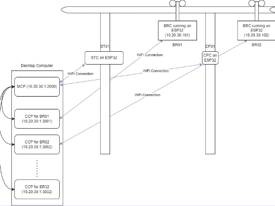

# Introduction
Last semester, I had the opportunity to work on a project called 'Blade Runner' for one of my engineering units. For this project, we were tasked with making a small-scale monorail system from scratch. The end goal was to create a carriage that would be able to wirelessly communicate with a Master Central Program (MCP) and perform functions such as arriving at stations, departing from stations and make decisions based on environmental inputs. 

We were all assigned groups based on our different engineering majors. Depending on the major, each group would work on either the Communications, Motions or Structural component of the carriage. For each carriage there would be 1 Communications, 1 Motions and 1 Structures team. As a software major, I was a part of a Communications group. Our role was to create two different programs; a Carriage Control Program (CCP) and a Blade Runner Controller (BRC). The github repository for our CCP and BRC code is available [here](https://github.com/christian-mejillano/BladeRunner2024/).

# Project Design

## MCP
One Communications team from each class was responsible for creating the MCP. The role of the MCP was to act as a central control system that controls the movement of the Blade Runners (BRs) on the track and decide when the BRs should stop. This was achieved by sending and receiving messages to and from the CCP, Checkpoint Controllers (CPC) and Station Controllers (STC). The CPC and STC both ran on ESP32 microcontrollers and weren't a part of my teams' scope. 

The MCP and CCP ran on the same computer but communicated on different ports. Each group was given an account on this computer so that we could establish a SSH connection to transfer and run all of our CCP files. We used [MobaXTerm](https://mobaxterm.mobatek.net/) for this as it made transferring files much easier.

## CCP
The main role of the CCP was to act as an interface program between the BRC and MCP. The program was responsible for receiving commands from the MCP, interpreting these commands and communicating the appropriate message to the associated BRC wirelessly. We were given a document which outlined the communication requirements between the MCP and CCP from the group. This document specified the message details and format (JSON) and that the communication between the two programs should be over UDP.

## BRC

# Result