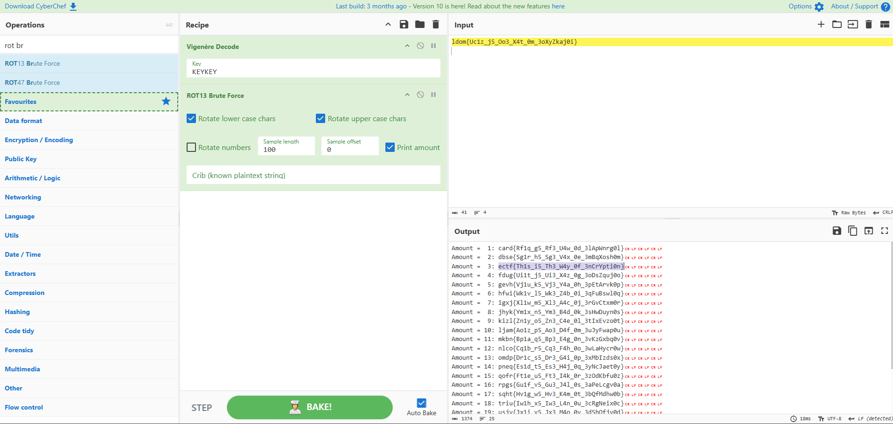
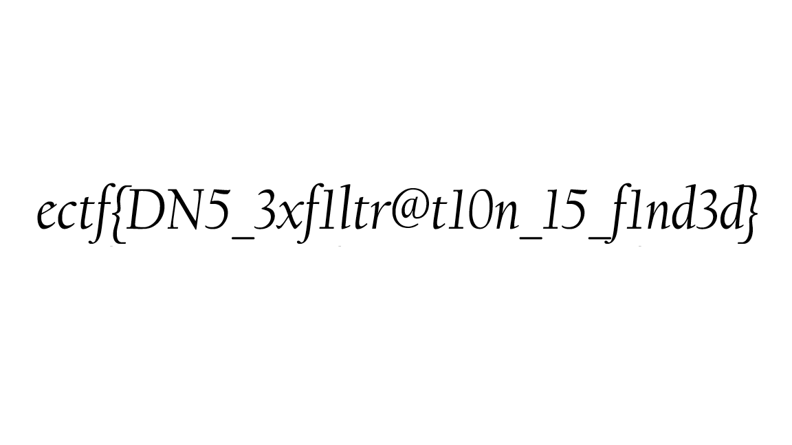

Over the weekend, I solo participated in the 48-hour ECTF. I ranked 53rd out of 383 teams. Massive thanks to the [Cyber & Chill](https://ctftime.org/team/299061) team for hosting this CTF.

# Cryptography
## ASCII me anything but the flag
> **Description**: There is an encrypted flag, good luck with that I encrypted it well!
> 
> 108 100 111 109 123 85 99 49 122 95 106 53 95 79 111 51 95 88 52 116 95 48 109 95 51 111 88 121 90 107 97 106 48 105 125 10 10 69 98 111 98 32 102 112 32 118 108 114 111 32 104 98 118 44 32 100 108 108 97 32 105 114 122 104 32 58 32 72 66 86 72 66 86 10 10 87 101 108 108 32 100 111 110 101 44 32 98 117 116 32 110 111 119 32 100 111 32 121 111 117 32 107 110 111 119 32 97 98 111 117 116 32 116 104 101 32 103 117 121 32 119 104 111 32 103 111 116 32 115 116 97 98 98 101 100 32 50 51 32 116 105 109 101 115 32 63

> **Author**: Antoine

Looking at the range of numbers, my first guess was to convert them to ASCII.


I guessed correct. From the conversion, the first two lines are still encrypted somehow but the last line hints towards what the next step is. Julius Caesar was stabbed 23 times so the next step must be to use the Caesar cipher.

Putting the second line (`Ebob fp vlro hbv, dlla irzh : HBVHBV`) into Cyberchef with a variation of the Caesar Cipher (ROT47) to decipher the text gives the result:


Now we have a key: `KEYKEY`. Using Cyberchef again, and the first line from the ASCII conversion (`ldom{Uc1z_j5_Oo3_X4t_0m_3oXyZkaj0i}`) we can use Vigenère decipher to get the flag:



Flag: `ectf{Th1s_i5_Th3_W4y_0f_3nCrYpti0n}`

## Cracking the Vault
> **Description**: The vault is locked with a key, but we've managed to access a security computer. Unfortunately, the key is encrypted, and the owner forgot to remove the file that encrypts it. It appears to be some sort of homemade encryption, but don’t worry this should be a piece of cake for you, right?

> **Author**: Antoine

For this challenge, there are two files. A python file which has an encryption function and a text file which is most likely the output of the python file.

**Encryption.py**:
```Python
import secrets
import hashlib

def encryption(text):
    encrypted = []
    random = secrets.SystemRandom()

    padding_length = 256 - len(text) % 256
    raw_padding = [chr(random.randint(32, 126)) for _ in range(padding_length)]

    scrambled_padding = [chr((ord(c) * 3 + 7) % 94 + 32) for c in raw_padding]
    shifted_padding = scrambled_padding[::-1]

    padded_text = ''.join(shifted_padding) + text

    final_padded_text = ''.join(
        chr((ord(c) ^ 42) % 94 + 32) if i % 2 == 0 else c
        for i, c in enumerate(padded_text)
    )

    secret_key = str(sum(ord(c) for c in text))
    secret_key = secret_key[::-1]

    hashed_key = hashlib.sha256(secret_key.encode()).hexdigest()

    seed = int(hashed_key[:16], 16)

    random = secrets.SystemRandom(seed)

    for i, char in enumerate(text):
        char_code = ord(char)
        shift = (i + 1) * 3
        transformed = (char_code + shift + 67) % 256
        encrypted.append(chr(transformed))

    return ''.join(encrypted), seed

with open('VaultKey.txt', 'r') as f:
    text = f.read()

encrypted_text, seed = encryption(text)

with open('VaultKey_encrypted.txt', 'w') as f:
    f.write(encrypted_text)

print("The file has been successfully encrypted!")
```

From the code it's clear that the encryption function must be reversed and run on the text file to get the flag. At first I was a bit confused on how to approach this but going through the code I saw that there are a lot of red herrings. The main encryption that is happening to the original flag text is:
* Convert each character to its ASCII value.
* Calculate a shift value based on the character's position.
* Add the shift value and 67 to the ASCII value the mod it by 256.
* Add this ASCII value to the final encrypted text.

Using this information, the decryption function can be created:
```Python
def decryption(encrypted_text):
    decrypted = []

    for i, char in enumerate(encrypted_text):
        char_code = ord(char)
        shift = (i + 1) * 3
        transformed = (char_code - 67 - shift) % 256
        decrypted.append(chr(transformed))

    return ''.join(decrypted)

with open('filepath_to_VaultKey_encrypted.txt', 'r', encoding="utf-8") as f:
    encrypted_text = f.read()
print(encrypted_text)

decrypted_text = decryption(encrypted_text)

print(decrypted_text)
```

Running this python function on the provided encrypted file gives:


Flag: `ectf{1t_W45_ju5T_4_m1nu5}`

## RSA Intro
> **Description**: This is just a brief introduction to RSA nothing more nothing less.

> **Author**: Antoine

This challenge was pretty straightforward. We are given a text file that has **n**, **e** and **c**. So the RSA encryption can be easily reversed by putting the given values into a RSA deciphering tool:


Flag: `ectf{b4sic_F4cT0rDb_rS4}`

## OIIAIOIIAI 😼
> **Description**: The cat made a mess of the flag , I have to retrieve the flag or my boss will be mad.
> 
> }eYcbt4fB{_yD0nUu_05Rp_1TNh_GM13R_

> **Author**: Antoine

Given the challenge name, the text has been encrypted by some sort of 'spinning' or 'turning'. After some trial and error with different combinations of decrpytion on Cyberchef, I noticed something interesting. Starting from the second character in the encrypted text, skipping every other letter gives 'ectf'. The first half of the flag is every even character and the second half is every odd character. I reversed this in python:
```Python
input = "}eYcbt4fB{_yD0nUu_05Rp_1TNh_GM13R_"
result = ""

for i in range(1, len(input), 2):
    result += input[i]

for i in range(0, len(input), 2):
    result += input[i]

print(result)

reverseString = result[17:]
result = result[:17]
reverseString = reverseString[::-1]
result += reverseString
print(result)
```

Flag: `ectf{y0U_5p1N_M3_R1GhT_R0unD_B4bY}`

# Forensics
## Justapcap
> **Description**: An image has been stolen, can you find it in the PCAP file?

> **Author**: Greg

For this challenge, we are given a pcap file. At first glance, opening this in Wireshark, I can see that the file is just a whole lot of DNS messages sent from the same source and sent to the same destination.


After inspecting the first few lines of the pcap file, I noticed that the body of the first DNS request matched the hex file signature of a PNG file (`89 50 4E 47 0D 0A 1A 0A`).


To get the actual image, I needed to extract all the lines without the words "exfil" or "attacker" in them. After doing this, I noticed that the number "2" was at the start of every row so I used the `cut` command to get rid of this.


However the file still wasn't being recognised as a proper PNG file and I started feeling like I hit a wall. After much investigation, I decided to have a look at it manually in notepad and noticed that there were many junk lines that needed to be removed.


After manually removing these lines, I reversed the hex dump using:


Opening binImage.png gave:



Flag: `ectf{DN5_3xf1ltr@t10n_15_f1nd3d}`

## My Dearest
> **Description**: I have Received a love letter by a fake email. Can you help me to find who is the author?

> **Author**: Greg

This one was pretty straightforward. We are given a word document and need to submit the author's name as the flag. I did this through exiftool.


Flag: `ectf{MichelTeller}`

## Capture the Hidden
> **Description**: A cybersecurity agent intercepted suspicious network traffic before disappearing. The attackers attempted to erase their tracks, but a PCAP file was recovered.
>
> Somewhere within these packets, a crucial file was exfiltrated. Can you analyze the traffic, extract the hidden data, and uncover the secret message?

> **Author**: Greg

This challenge wasn't too bad either. Looking at the pcap file, 3 TCP messages instantly stand out. Right before the first TCP message is sent, a FTP request is sent with the username as "hacker".


A couple of lines before this FTP message, a POST request is sent to the same destination. Looking at the body of this POST request, there seems to be some sort of encrypted data, my first guess being base64.


Flag: `ectf{P05t_1s_v3ry_345y_T0_F1ND}`

# Hardware
## ORbit
> **Description**: You are given a logic circuit (see orbit.png) and asked to give the binary output corresponding to the input such that (x0, x1, x2, x3, x4) = (0, 1, 0, 1, 0). Surround your answer with ectf{ } to obtain the flag.
>
> As an example, entering (x0, x1, x2, x3, x4) = (1, 0, 0, 0, 0) gives (y0, y1, y2, y3, y4, y5, y6), so the flag would be ectf{1111010}.

> **Author**: Loïc

This challenge was really fun and different to the challenges I've done before. We are given a logic diagram and an input and need to find the output.


I thought about doing this using some sort of simulator website but ended up doing the calculations by hand. I first labelled all the AND gates (can be seen in the image) to make it easier when doing the calculations.


Doing this by hand was probably not the best way, since it's pretty easy to mess up as I did on the left page and had to recalculate the values of y. In the end I was able to get the right values of y and as a result the right flag.

Flag: `ectf{0101011}`

## It is Trivial
> **Description**: I forgot to write down the description for this challenge but it was just the previous challenge but way more complex. The input is 30478191278.

> **Author**: Loïc

Same scenario again, but this time it's much harder.


This time I decided to use [logic.ly](https://logic.ly/). Since it was even more easy to mess up for this challenge, I labelled all the gates according to their column. This way I would be able to cross check the gates by labelling them in logic.ly.

Looking at the diagram, I was a bit confused on how the number that was given would become the input. On the diagram, I noticed that 6 digit binary numbers were being used to produce the output in each "block". There would be a carry over bit for the next block, which linked the whole circuit diagram. I then converted the given number into binary but the number of digits wasn't a multiple of 6 (it was 35). This was solved by adding an extra 0 at the start of the converted binary number: `011100011000101001000100101010101110`. I could split this up into blocks of 6 bits and input them into logic.ly.

Now came the tedious part, recreating the diagram. After a lot of time clicking away and rechecking I was able to replicate the logic circuit from the diagram.


I used switches to set the input (off is 0 and on is 1) and lights for the output. I somehow got lucky and had the correct output on the first go!

Flag: `ectf{100010011000}`

# OSINT
## Project-153-Q1
> **Description**: 
> 
> Thomas Yatangaki : Have you ever visited this place ? I can't remember the name...
> Maboi 💪 : Me neither 😕


This first OSINT challenge was easy. Google searching the image returned the location of the place.

Flag: `ectf{Chutes_du_Caramy}`

> **Author**: Egan

## Project-153-Q2
> **Description**: 
>
> Thomas Yatangaki : Did you know that the exact position where I took the photo had a name ? It is such an interesting place full of history 😮.

> **Author**: Egan


This challenge took some time since it wasn't straightforward. Reverse searching the image, we get a mountain range in France known as `Massif de l'Esterel`. However this wasn't the right flag.

Going through the search results, there are a lot of matches but none that give any hint as to what the flag could be. Maybe if I found the exact place of the photo, there might be a hint.

I found this flicker [post](https://www.flickr.com/photos/jmenj/23878898442), which was geo-tagged. Going to this exact [place](https://www.google.com/maps/search/Antheor-Cap-Roux,+c%C3%B4te+rocheuse/@43.4475326,6.9050344,15z/data=!3m1!4b1?hl=en-US&entry=ttu&g_ep=EgoyMDI1MDIyNi4xIKXMDSoASAFQAw%3D%3D) in Google Maps and going into street view at this [point](https://www.google.com/maps/@43.4487237,6.9182804,3a,75y,194.95h,88.45t/data=!3m8!1e1!3m6!1sAF1QipPxgLu2VmPUZFcJlTkKdQANUfD0JakceY-8b49j!2e10!3e11!6shttps:%2F%2Flh3.googleusercontent.com%2Fp%2FAF1QipPxgLu2VmPUZFcJlTkKdQANUfD0JakceY-8b49j%3Dw900-h600-k-no-pi1.5456572426063104-ya337.94733492539604-ro0-fo100!7i10240!8i5120?hl=en-US&entry=ttu&g_ep=EgoyMDI1MDIyNi4xIKXMDSoASAFQAw%3D%3D), I can see that it is the exact place and the name of this place is Pointe de l'Observatoire. This happens to be the flag!

Flag: `ectf{Pointe_de_l'Observatoire}`

## Project-153-Q4
> **Description**: 
> 
> Thomas Yatangaki : Bro, I think, we did the gr90 the wrong way round.
>
> Maboi 💪 : damn 💀 At least, the view was better at the end. Wait, do you see the place in the background in the middle ? We've got to get over there, what's the name?
>
> Thomas Yatangaki : No I don't think we should 💀.

> **Author**: Egan


I needed to find the name of the mounts in the background of the image. Reverse searching this image using Google Lens, I'm able to find the name of the place in a [post](https://sr.wikiloc.com/rute-pjesacenje-po-planinama/bormes-les-mimosas-notre-dame-de-constance-32828412) on a hiking website.

I then went into Google Maps and searched `Chapelle Notre-Dame de Constance`. Going into street view, the [chapel](https://www.google.com/maps/@43.1561787,6.3401265,3a,15.7y,134.04h,87.72t/data=!3m11!1e1!3m9!1sAF1QipNSbPcBAbMGunpAaaK-qP273ScI0AKbc32O1_wU!2e10!3e11!6shttps:%2F%2Flh3.googleusercontent.com%2Fp%2FAF1QipNSbPcBAbMGunpAaaK-qP273ScI0AKbc32O1_wU%3Dw900-h600-k-no-pi2.2848220531248984-ya38.03703992759836-ro0-fo100!7i10240!8i5120!9m2!1b1!2i40?entry=ttu&g_ep=EgoyMDI1MDEyOS4xIKXMDSoASAFQAw%3D%3D) seems like the right place since I can see two islands in the back. Zooming all the way out on Maps, I see the name of the two islands, one of them being the flag.

Flag: `ectf{Île_du_Levant}`

## Project-153-Q5
> **Description**: 
>
> Maboi 💪 : Bruh, the name of the mountain where I was lmao 🧠.

> **Author**: Egan


For this challenge, I had to crop the image since it was too big for searching on Google. Once cropped I was able to find this AllTrails [post](https://www.alltrails.com/trail/france/var/pointe-du-cerveau-et-le-gros-cerveau-vtt), which gave the name of the mountain.

Flag: `ectf{Gros_Cerveau}`

## Project-153-Q6
> **Description**: 
>
> Thomas Yatangaki : unfortunately, it's not part of project 153, but it's still very beautiful here 😻.
>
> Maboi 💪 : How many steps were there again ?
>
> Flag format: ectf{number_zipcodeofthetown}

> **Author**: Egan


This challenge was two-fold. I had to find the number of stairs in the image and also the zip code of the place. I was able to find this [page](https://www.dreamstime.com/editorial-image-sunny-street-shops-restaurants-moustiers-sainte-marie-france-july-lovely-village-image97861020) which gave the name of the place; Notre Dame de Beauvoir. Using this, I found the number of stairs on this [website](https://provence-alpes-cotedazur.com/en/things-to-do/culture-and-heritage/places/chapelle-notre-dame-de-beauvoir-moustiers-sainte-marie-en-4067124/). Finally, I used maps to get the postcode of the place.

Flag: `ectf{262_04360}`

# Steganography
## Silhouette in Cyberpunk
> **Description**: I didn't write down the description for this challenge but it was something to do with the given image.

> **Author**: Antoine


This challenge was different, confusing at first but very fun. I used all the common stega tools (stegsolve, binwalk, exiftool) but nothing gave any clue. I had a closer look at the image and saw that there were dots on two of the buildings. I had a hunch that it was Braille (I don't know how I thought about this as I've never seen the syntax of Braille). I had guessed correctly!

Using a [Braille convertor](https://abcbraille.com/braille) and the dots from the first building I was able to get the first message.


⠹⠊⠎
⠊⠎
⠚⠥⠌
⠁
⠙⠥⠍
⠍⠽⠂
⠝⠊
⠉⠑
⠞⠗⠽ = this
is
just
a
dum
my,
ni
ce
try

Now I knew that I was on the right track. 

I did the same with the building in the back left:

⠓⠼⠁⠙
⠙⠼⠉⠝
⠼⠁⠝
⠹⠼⠉
⠙⠼⠙
⠗⠅⠝⠼
⠉⠎⠎ = h14
d3n
1n
th3
d4
rkn
3ss

Flag: `ectf{h1dd3n_1n_th3_d4rkn3ss}`

# Web
## Java Weak Token
> **Description**: The admin has stored a flag in the admin section, but he let you access the page since he has secured the access to it. Maybe you should show him why using a weak secret isn't a good idea 🙂.

> **Author**: Louis

For this challenge, the following website is presented:


We are shown our JWT token and somehow need to use this information to access the admin page. Going into Burp Suite, I can see that this exact token is being sent for authorisation.


I used [this](https://github.com/lmammino/jwt-cracker) JWT cracker to find out what the secret is to maybe modify the JWT and pretend to be the admin.


Let's go! We got the secret. I can now modify the token using [jwt.io](https://jwt.io/).


I used the default HS256 algorithm, entered the secret and changed the username to admin. Next, I clicked on the "Can I access the admin page?" button and intercepted the request and replaced my token with the modified token.


And after hitting forward:


Flag: `ectf{JwT_T0keN_cR34t0r}`

# Thank You
If you’ve made it this far, I hope you’ve enjoyed this writeup and thank you for reading it! Thanks again to the [Cyber & Chill](https://ctftime.org/team/299061) team for organising this CTF.