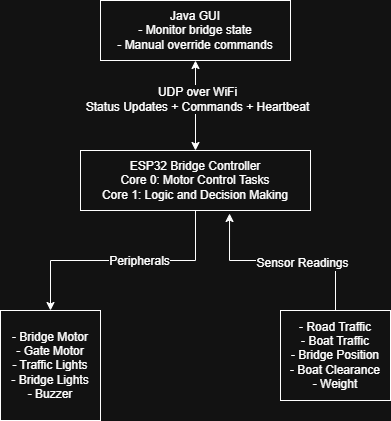
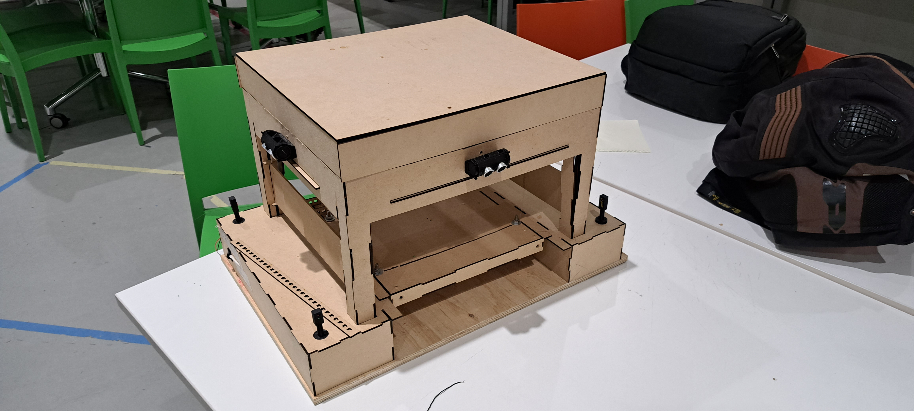

# What was the Project?

This was a really fun project I got to work on for my ENGG3000 unit at university. The objective was simple: we had to build and demonstrate a small-scale vertical lift bridge from scratch. It was a multi-disciplinary project with two groups for each bridge, a **Systems** Group (Software, Electrical and Mechatronics majors) and a **Structures** Group (Civil and Mechanical majors).

As part of the systems group we were responsible for creating all the hardware and software that would allow full control of the bridge: sensors (ultrasonic and weight sensors), power systems, motor control through Pulse Width Modulation (PWM) signals, and LED traffic light systems using shift registers. My role in all this was two-fold, create a multi-threaded C++ program for an ESP32 which would act as the bridge controller and create a remote user interface that would allow users to monitor and control the bridge.

This post is going to go through the entire project; from requirements to the final product that we delivered alongside all the design decisions made and challenges faced (all the fun stuff). This is what the bridge and remote interface looked like for the final demonstration:


All the source code for this project, that is referenced in this post, can be found in these two repositories (totally has a descriptive commit messages):

[ESP32 Bridge Controller Source Code](https://github.com/MT1218/ENGG3000-ESP32)

[Java GUI Source Code](https://github.com/MT1218/ENGG3000-Java-Program)

If you don't want to read the entire code explanation, you can [skip all the yap and go to the photos/video.](#final-look-of-the-esp32-and-bridge)

# Overview of the System

## Requirements

A week before the unit started, we were given specific requirements for what the bridge should be able to do. These were the relevant requirements summarised from the specifications:

1. The bridge is to have an automatic control system that detects the arrival of shipping traffic.
2. When shipping traffic arrives, it should signal for the boat to wait, safely signal vehicular and pedestrian traffic to stop, and then open the bridge.
3. Once the shipping traffic has passed through safely, the bridge should close and allow vehicular and pedestrian traffic to resume crossing the river.
4. The control system must provide some form of local visual indication of the state of the sensors and system.
5. It must also provide a remote user interface on a computer that shows the state of the bridge, sensors and system, and allow the control of all bridge operations including overriding sensor inputs.
6. Ideally, the user interface will be wirelessly connected to the control system via Wi-Fi.
7. The bill of materials for building the bridge must not exceed AUD$100.

## System Architecture

Based on the requirements above my team decided on using an **ESP32 DevKit v1** board as the bridge controller and a Java program for the remote interface. These two components were the main parts and would communicate wirelessly. This is a really high level overview of the main functions of the two components:

### ESP32 Bridge Controller

- Runs multi-threaded FreeRTOS tasks across two CPU cores.
- Controls all the sensors, motors and traffic lights.
- Is able to run in two modes; automatic and override.
- Sends status updates to the Java program every second over UDP.

### Java Remote Interface

- Shows the real time state of the bridge.
- Allows the operator to switch between automatic and override modes.
- Allow control of the bridge, gates and lights in override mode.
- Sends a heartbeat message to the ESP32 every 2 seconds to maintain connection.

### High Level Diagram

Putting all that into a visual perspective:



## Technologies Used

Since there were two parts to this project (the Java program and ESP32 C++ program) there was a variety of technologies that I got to work with. I've summarised them as best as I could below.

### ESP32 Development

- `PlatformIO VSCode Extension` for development and building.
- `Arduino Framework` for the ESP32 programming.
- `FreeRTOS` for managing the multi-threaded tasks.
- `WifiUDP` Library for UDP network communications.
- `LEDC` for PWM motor and buzzer control.
- `PulseIn` for ultrasonic sensor readings.

### ESP32 Peripherals

- 6x [HC-SR04 Ultrasonic Sensors](https://core-electronics.com.au/33v-ultrasonic-distance-sensor.html) (traffic detection, bridge position and clearance).
- 1x [LM258P Op-Amp](https://core-electronics.com.au/lm258p-dual-channel-op-amp-through-hole-sparkfun.html) (weight on bridge sensing through the motor current).
- 2x [SN74HC595N Shift Registers](https://core-electronics.com.au/shift-register-8-bit-sn74hc595.html) (LED traffic light control).
- 1x [FS5109R Servo](https://core-electronics.com.au/feetech-fs5109r-standard-servo-10kg-cm.html) (motor to control the bridge).
- 1x [FS90 9g Micro Servo](https://core-electronics.com.au/feetech-fs90-1-5kgcm-micro-servo-9g.html) (motor to control boom gates (closed when bridge is open to stop road traffic)).
- 1x [Piezo Buzzer](https://core-electronics.com.au/large-enclosed-piezo-element-w-wires.html) (buzzer for audio warnings while the bridge is moving).
- 1x Photo-Resistor, couldn't find the link :/ (used for controlling the white bridge lights and allow them to act as street lights).

### Java Development

- `Java Swing` for the GUI.
- `DatagramSocket` and `DatagramPacket` for UDP network communication.
- `Thread` library for concurrent send and receive operations.

### Network Configuration

- UDP on `port 3031` (ESP32 listens on this) and `port 3032` (the Java program listens on this).
- There is a `standard text based message format` where key-value pairs are pipe-delimited.
- Bridge `status updates` every 1 second.
- `Heartbeat messages` from the Java program to the ESP32 every 2 seconds.

### Testing and Simulation

- For testing we used `Wokwi` (paid for a private gateway) which is an ESP32 simulator.
- Used pre-processing directives (**#define WOKWI_SIMULATION** and **#ifdef WOKWI_SIMULATION**) to mock sensor readings.

# ESP32

Now for the fun part; the actual code implementation for the ESP32. The code base is pretty large so I can't explain it line by line. Instead I've decided to explore and go through the code based on the main functionalities and features (and just anything that I found really fun to learn).

## Purpose and the Operating Modes

The main purpose of all the code on the ESP32 is to essentially be the "brain" of the bridge system. So this means continuously running and monitoring the sensor inputs, controlling the servos based on this input and controlling all the traffic flow. There are two main modes in which the ESP32 can operate:

**Automatic Mode** (Default):

- In this mode the ESP32 continuously monitors the road and boat traffic sensors.
- Based on whether the bridge is open or closed, if there is traffic waiting for bridge to change its state (e.g. boats waiting for bridge to open), the opening/closing sequences will be initiated. The two sequences are `OPENING_FOR_BOATS` and `CLOSING_FOR_CARS`.
- After the sequence is complete the bridge will go into either a `CARS_PASSING` or `BOATS_PASSING` state (for 10 seconds) to allow for traffic to pass.
- After the passing states the bridge will go into the `IDLE` state. From this state the cycle will repeat depending on input from the traffic sensors.
- This mode doesn't require any user/operator for it work.

**Override Mode** (Manual Control):

- This mode allows the operators to individually control all parts of the bridge (traffic lights, buzzer and bridge/gate positions).
- The operator can also trigger the `OPENING_FOR_BOATS` and `CLOSING_FOR_CARS` sequences alongside a `TESTING` sequence.
- Commands are queued and there is a max of 3 to prevent a buffer overflow.
- There are safety checks to prevent the bridge from entering this mode if there is traffic. This is implemented since the use case for this mode is to allow for a bridge operator to test the bridge and its functions not for manually managing traffic.

## Types and State Definitions

For the different states that all the various parts of the system can be in, I've created readable enums to prevent any invalid states during compilation or while the program is running:

```C++
/* Global Enums */

// Represents whether code is in automatic or override state, auto by default
enum OperationalMode { AUTOMATIC, OVERRIDE };

// Represents whether the bridge is opened, closed or in an unknown state
enum BridgeGateState { CLOSED, OPEN, UNKNOWN };

// Represents state of boat and road lights
enum LightColours { RED, GREEN, YELLOW, NONE, ALL };

// Represents whether bridge lights should be on or off
enum BridgeLightState { ON, OFF };

// Represents whether the buzzer sound should be on or off
enum BuzzerSound { SOUND, NO_SOUND };

// Represents which motor to move
enum Motor { BRIDGE, GATE };

// Represents which sensor to read from
enum AdcValue { PHOTO_RESISTOR, BRIDGE_WEIGHT };

// Bridge sequence state
enum BridgeSequenceState {
  IDLE,
  OPENING_FOR_BOATS,
  BOATS_PASSING,
  CLOSING_FOR_CARS,
  CARS_PASSING,
  DIAGNOSTIC,
  TESTING
};

// Represents which stage the bridge is at while moving
enum BridgeMovementState { STATE_ONE, STATE_TWO, STATE_THREE, STATE_FOUR, STATE_FIVE, RECOVERY, SUCCESS };
```

## State Machine and Multi-Core Architecture

Since the ESP32 we used has a dual-core processor it allowed us to separate the motor control and the actual decision logic onto their own threads. The reason we decided to separate it this way was so that we were able to run the motor operations without any interruptions, have the processing of sensor inputs running and communication with the Java program maintained all at the same time.

This is how the tasks were allocated on the two cores:

**Core 0 (Protocol CPU) - Motor Control Tasks**:

- Bridge motor control task.
- Gate motor control task.
- Executes commands from the queues.

**Core 1 (Application CPU) - Decision Logic**:

- Runs the automatic mode sequences.
- Executes commands from the override command queue.
- Runs the main loop which includes communication with the Java program.

Creating the tasks:

```C++
// Tasks for Multithreading
TaskHandle_t AutomaticModeTask;
TaskHandle_t BridgeControlTask;
TaskHandle_t GateControlTask;
TaskHandle_t OverrideQueueTask;

// Create tasks
xTaskCreatePinnedToCore(automaticModeTask,   // Task function
                        "AutomaticMode",     // Name
                        10000,               // Stack size
                        NULL,                // Parameter
                        2,                   // Priority (higher than motor tasks)
                        &AutomaticModeTask,  // Task handle
                        1);                  // Core 1 (Application CPU)

xTaskCreatePinnedToCore(bridgeControlTask,   // Task function
                        "BridgeControl",     // Name
                        4096,                // Stack size
                        NULL,                // Parameter
                        1,                   // Priority
                        &BridgeControlTask,  // Task handle
                        0);                  // Core 0 (Protocol CPU)

xTaskCreatePinnedToCore(gateControlTask,   // Task function
                        "GateControl",     // Name
                        4096,              // Stack size
                        NULL,              // Parameter
                        1,                 // Priority
                        &GateControlTask,  // Task handle
                        0);                // Core 0 (Protocol CPU)

xTaskCreatePinnedToCore(overrideQueueTask,   // Task function
                        "OverrideQueue",     // Name
                        4096,                // Stack size
                        NULL,                // Parameter
                        3,                   // Priority (highest - processes overrides)
                        &OverrideQueueTask,  // Task handle
                        1);                  // Core 1 (Application CPU)
```

### Concurrency Justification

This concurrency was important for a couple of reasons:

1. The sensor readings were not just for the traffic but also for knowing when to stop rotating the bridge servo. This sounds overkill but actually makes sense.
   - We initially had the bridge servo rotate for 5 seconds (in either direction) for opening and closing. However, we needed the bridge to be precise in terms of where it stopped and this timing method had a lot of variables.
   - First was that the servo would rotate quicker if there was more power going to it and this was never going to be consistent since we can't control the variance in how much current it draws. Second, this would vary even more as the servo got used more due to wear.
   - So our solution was to have an ultrasonic sensor on top of the bridge. The motor would stop moving once the bridge was at a certain distance giving a more precise and consistent bridge position every time.

2. When we got to the testing phase we discovered that running the motors created electromagnetic interference (EMI) that caused the ultrasonic sensor readings to be invalid (there wouldn't be a reading at all).

   - The reason for this EMI was due to the design of the circuit board (PCB). So the solution expanded on the first point. We were still going to have a distance based bridge movement system instead of a time based one but it would be a stop-measure-restart cycle.
   - The motor would have to stop in between readings (150ms between the motor moving and the first reading), take 3 readings (average them) and then restart the motor if the target wasn't reached. This sequence needed to run in parallel with the decision logic and network operations. 
   - Because of the cycle approach to the bridge motor movement, the demonstration ended up having a "choppy" feel. The bridge would open/close through small movements (this included the buzzer noise which we decided should be on when the bridge is moving).

3. The emergency stop command needed to halt the motors instantly, regardless of what the decision logic is doing. Since the motor control was on a different core, stopMotor() functions execute without waiting for the state machine or network packets to be processed.

### FreeRTOS Tasks and Queues

For communication between the two cores, we used **FreeRTOS queues**. This allowed both cores to "talk" to each other without having to directly call upon their functions, meaning that the decision logic could send commands for the motor tasks to consume rather than directly controlling the motors.

```C++
// Command structures
struct OverrideCommand {
  char command[50];
};

struct BridgeCommand {
  BridgeGateState desiredState;
};

struct GateCommand {
  BridgeGateState desiredState;
};

// Create queues
QueueHandle_t bridgeCommandQueue = xQueueCreate(5, sizeof(BridgeCommand));
QueueHandle_t gateCommandQueue = xQueueCreate(5, sizeof(GateCommand));
QueueHandle_t pendingOverrideQueue = xQueueCreate(10, sizeof(OverrideCommand));
```

So say when the automatic mode task decides the bridge should open since there is boat traffic waiting, it doesn't open the bridge directly, it queues the command instead by calling `changeBridgeStateAsync`:

```C++
void changeBridgeStateAsync(BridgeGateState desiredMode) {
  // Check if enough time has passed since last bridge state change
  extern unsigned long lastBridgeStateChange;
  unsigned long currentTime = millis();

  if (currentTime - lastBridgeStateChange < BRIDGE_STATE_CHANGE_COOLDOWN) {
    Serial.println("INFO: Bridge state change blocked, cooldown period active");
    sendUpdate("SYSTEM_UPDATE: dequeued_last_message");
    return;
  }

  extern BridgeGateState currentBridgeState;
  extern QueueHandle_t bridgeCommandQueue;

  // Update the queue if the desired and current states aren't the same
  if (desiredMode != currentBridgeState) {
    BridgeCommand cmd = {desiredMode};
    xQueueSend(bridgeCommandQueue, &cmd, 0);
  }
}
```

The bridge control task (on Core 0) then waits for these commands (in this case opening the bridge) and then executes them. The code snippet below shows how the `bridgeControlTask` works for opening the bridge. The logic for closing the bridge and weight checks have been removed. I just want to show how the queues are being used and our stop-measure-restart cycle.

```C++
void bridgeControlTask(void *parameter) {
  // Command can either be OPEN or CLOSED
  BridgeCommand cmd;

  // Runs forever
  for (;;) {
    // When a command is received (either from automatic mode or override) it wakes up
    if (xQueueReceive(bridgeCommandQueue, &cmd, portMAX_DELAY)) {
      // Take mutex before changing state
      if (xSemaphoreTake(stateMutex, portMAX_DELAY)) {
        // ... If desired state is CLOSED

        else if (cmd.desiredState == OPEN && currentBridgeState != OPEN) {
          // Check weight on bridge
          Serial.println("INFO: Checking weight on the bridge");

          // Release for weight check
          xSemaphoreGive(stateMutex);

          long weightReading = checkBridgeWeight();

          // Send weight reading to Java
          sendUpdate("WEIGHT_CHECK: " + String(weightReading));

          // Re-acquire lock
          xSemaphoreTake(stateMutex, portMAX_DELAY);

          // ... weight checking logic

          Serial.println("INFO: Weight check passed (" + String(weightReading) + "), opening bridge");

          // Rotate the motor to open the bridge
          rotateMotorForOpen(BRIDGE);

          // Release mutex briefly to allow motor to start
          xSemaphoreGive(stateMutex);
          vTaskDelay(200 / portTICK_PERIOD_MS);
          xSemaphoreTake(stateMutex, portMAX_DELAY);

          // Update the timestamp when bridge state change begins
          lastBridgeStateChange = millis();
          // Track how long it takes to open the bridge
          unsigned long operationStartTime = millis();
          // Release mutex
          xSemaphoreGive(stateMutex);

          // Read how far away the bridge is
          long bridgeDistance;

          // Booleans to keep track of errors
          bool bridgeIsOpen = false;
          bool timeoutOccurred = false;

          // Greater than bridge open distance since bridge is moving closer
          // Bridge starts at 15cm (CLOSED), moves to 1cm (OPEN)
          while (bridgeDistance > BRIDGE_OPEN_DISTANCE) {
            // Timeout protection
            if (millis() - operationStartTime > BRIDGE_TIMEOUT) {
              timeoutOccurred = true;
              break;
            }

            // Stop motor for stable reading (avoid EMI interference)
            stopMotor(BRIDGE);

            // Wait for motor to fully stop and EMI to settle
            vTaskDelay(150 / portTICK_PERIOD_MS);

            // Take multiple readings and average them to filter out noise/EMI
            long reading1, reading2, reading3;
            bool valid1, valid2, valid3;

            // Calculate average of valid readings
            int validCount = 0;
            long sum = 0;

            if (valid1) {
              sum += reading1;
              validCount++;
            }
            if (valid2) {
              sum += reading2;
              validCount++;
            }
            if (valid3) {
              sum += reading3;
              validCount++;
            }

            if (validCount == 0) {
              Serial.println("ERROR: All sensor readings invalid - EMI or sensor failure");
              break;
            }

            bridgeDistance = sum / validCount;

            if (validCount < 3) {
              Serial.print("WARNING: Only ");
              Serial.print(validCount);
              Serial.println("/3 readings valid, using average");
            }

            Serial.print("INFO: Bridge distance (averaged): ");
            Serial.print(bridgeDistance);
            Serial.println(" cm");

            // Only restart motor if bridge hasn't reached target
            if (bridgeDistance > BRIDGE_OPEN_DISTANCE) {
              rotateMotorForOpen(BRIDGE);
              // Give motor time to build momentum before next check
              vTaskDelay(200 / portTICK_PERIOD_MS);
            }
          }

          // Check if we successfully reached open position
          if (bridgeDistance <= BRIDGE_OPEN_DISTANCE && !timeoutOccurred) {
            bridgeIsOpen = true;
          }

          if (xSemaphoreTake(stateMutex, portMAX_DELAY)) {
            // Stop the motor and update the bridge state
            stopMotor(BRIDGE);

            if (bridgeIsOpen) {
              currentBridgeState = OPEN;
              Serial.println("INFO: Bridge is OPEN");
            } else if (timeoutOccurred) {
              currentBridgeState = UNKNOWN;
              Serial.println("ERROR: Bridge state UNKNOWN after timeout");
            } else {
              currentBridgeState = UNKNOWN;
              Serial.println("ERROR: Bridge state UNKNOWN due to sensor failure or unknown error");
            }

            // Release mutex
            xSemaphoreGive(stateMutex);
          }
        }
        // If it's another command then release the mutex
        else {
          xSemaphoreGive(stateMutex);
        }
      }
    }
  }
}
```

The same logic is used for the gate task.

### Mutex Protection

While queues are being used to handle the communication between the tasks, shared variables still need to be protected from race conditions. In the code snipped you can see the use of `xSemaphoreTake` to try and acquire the mutex during the actual bridge movement logic. This mutex acquisition is also being used at the beginning of each task:

```C++
// Mutex declaration
SemaphoreHandle_t stateMutex;

// In automatic mode task (Core 1)
if (xSemaphoreTake(stateMutex, 100 / portTICK_PERIOD_MS)) {
  // Safe to read/write shared state
  if (currentOperationalMode == AUTOMATIC) {
    switch (currentSequenceState) {
      // ... The state machine logic
    }
  }
  xSemaphoreGive(stateMutex);
}

// In motor control task (Core 0)
if (xSemaphoreTake(stateMutex, portMAX_DELAY)) {
  stopMotor(BRIDGE);
  // Updating a shared variable
  currentBridgeState = OPEN;
  xSemaphoreGive(stateMutex);
}
```

The 100ms timeout in the automatic mode makes sure that no deadlocks happen. If it can't acquire the mutex within 100ms then it'll try again in 500ms. The motor/bridge tasks use `portMAX_DELAY` since the only run when specifically told to.

### Automatic Mode State Machine

The automatic mode task then utilises the bridge and gate tasks as a part of the main core bridge sequencing logic, running every 500ms on Core 1:

```C++
void automaticModeTask(void *parameter) {
  TickType_t xLastWakeTime = xTaskGetTickCount();
  
  for (;;) {
    if (xSemaphoreTake(stateMutex, 100 / portTICK_PERIOD_MS)) {
      if (currentOperationalMode == AUTOMATIC && 
          !isBridgeMovementExecutingInOverride) {
        
        switch (currentSequenceState) {
          case IDLE:
            // Check for traffic and initiate sequences
            if (canChangeBridge) {
              if (currentBridgeState == CLOSED) {
                long boatDistance = readUltrasonicDistanceBoatTraffic();
                if (isValidSensorReading(boatDistance) && 
                    boatDistance < BOATS_WAITING_DISTANCE) {
                  currentSequenceState = OPENING_FOR_BOATS;
                  sequenceStartTime = millis();
                }
              }
              // Check for cars when bridge is open...
            }
            break;
            
          case OPENING_FOR_BOATS:
            // Sequence with timing and safety checks
            break;
            
          case BOATS_PASSING:
            // Wait 10 seconds before checking for more traffic
            break;
            
          case CLOSING_FOR_CARS:
            // Similar to OPENING_FOR_BOATS but in reverse
            break;
            
          case CARS_PASSING:
            // Wait 10 seconds before returning to IDLE
            break;
            
          case DIAGNOSTIC:
            // Attempt position recovery
            break;
        }
      }
      xSemaphoreGive(stateMutex);
    }
    vTaskDelayUntil(&xLastWakeTime, 500 / portTICK_PERIOD_MS);
  }
}
```

The 500ms interval was chosen just to ensure that CPU cycles aren't wasted. The `vTaskDelayUntil` function makes sure that this logic runs at that 500ms interval regardless of how long the logic takes to run. Since the entire logic for the automatic task is too much to fit in this post here's the complete opening sequence with all the timing and safety checks:

```C++
case OPENING_FOR_BOATS:
  // Execute the sequence for opening the bridge
  {
    // currentMovementState is used here to ensure the functions aren't called again causing
    // cooldown blocks
    unsigned long elapsed = millis() - sequenceStartTime;
    // After 2s turn road traffic lights yellow
    if (elapsed >= 2000 && currentMovementState == STATE_ONE) {
      // After 2 seconds set the road lights to yellow
      setRoadTrafficLights(YELLOW);
      currentMovementState = STATE_TWO;
    }
    // After 8s set road traffic lights to red and close the gate
    else if (elapsed >= 8000 && currentMovementState == STATE_TWO) {
      // After 8 seconds set the road lights to red and close the gates
      setRoadTrafficLights(RED);
      changeGateStateAsync(CLOSED);
      currentMovementState = STATE_THREE;
    }
    // After 14s open bridge, 6s for gate to close (5s transition + 1s buffer)
    else if (elapsed >= 14000 && currentMovementState == STATE_THREE) {
      changeBridgeStateAsync(OPEN);
      currentMovementState = STATE_FOUR;
    }
    // After 25s, Check results (14s + 11s for bridge to open and stabilize)
    else if (elapsed >= 25000 && currentMovementState == STATE_FOUR) {
      // Reset movement state
      currentMovementState = STATE_ONE;
      // Go into diagnostics mode if the bridge state is unknown
      if (currentBridgeState == UNKNOWN) {
        currentSequenceState = DIAGNOSTIC;
        break;
      }

      // Allow up to 13 more seconds for the bridge to fully stop moving
      if (currentBridgeState != OPEN && elapsed < 38000) {
        currentMovementState = STATE_FOUR;
        break;
      }

      // If for some reason the bridge didn't open then set boat lights to red, open gate and go into RECOVERY
      if (currentBridgeState != OPEN) {
        setBoatTrafficLights(RED);
        changeGateStateAsync(OPEN);
        currentMovementState = RECOVERY;

        Serial.println("Info: Bridge state mismatch, expected OPEN, returning to CARS_PASSING");
        sendUpdate("SYSTEM_UPDATE: bridge_state_mismatch");
        break;
      }

      // Bridge is open, set boat lights to green
      setBoatTrafficLights(GREEN);
      currentMovementState = SUCCESS;
    }
    // After 30s If the bridge is in recovery state (bridge remains closed), set road lights to green and
    // go into CARS_PASSING
    else if (elapsed >= 30000 && currentMovementState == RECOVERY) {
      // Ensure gate is open before transitioning to CARS_PASSING
      changeGateStateAsync(OPEN);

      // Release mutex during delay
      xSemaphoreGive(stateMutex);
      // Wait 5s for gate to open
      vTaskDelay(GATE_TRANSITION_INTERVAL / portTICK_PERIOD_MS);
      xSemaphoreTake(stateMutex, portMAX_DELAY);

      setRoadTrafficLights(GREEN);

      currentSequenceState = CARS_PASSING;
      currentMovementState = STATE_ONE;
      sequenceStartTime = millis();
    }
    // After 25s if bridge has opened, set boat traffic lights to green and go into BOATS_PASSING
    else if (elapsed >= 25000 && currentMovementState == SUCCESS) {
      currentSequenceState = BOATS_PASSING;
      currentMovementState = STATE_ONE;
      sequenceStartTime = millis();
      Serial.println("Bridge opened: Waiting for boats to pass");
    }
  }
  break;
```

This sequence based approach turned out to work really well but was hell during testing. Simulating it was one thing, but manually having to figure out what an appropriate amount of time for each state was took forever since a lot of the times checking success states too early causes false failures since the bridge was still moving. The same exact logic but in reverse was used for closing the bridge. The `CARS_PASSING` and `BOATS_PASSING` states were essentially just 10 second delays to ensure the traffic had enough time to pass.

The override mode also followed the same logic except rather than the `CLOSING_FOR_CARS` and `OPENING_FOR_BOATS` being triggered by the sensor inputs they would be triggered by the commands sent from the Java program. There is also another state in the automatic mode (`DIAGNOSTIC`) but it's a safety feature so I'll discuss it in this [section](#diagnostic-and-recovery-mode).

## Light Control

Another part of this project that was really fun to implement were the traffic and bridge LED lights. These two types of lights had their own purpose. So there were traffic lights for the road traffic (red, yellow and green) and boat traffic (red and green). The bridge lights (only white) were controlled by a photo-resistor. The bridge lights were supposed to act as "street lights" so when the photo-resistor gets covered (simulating night time), the bridge lights go on.

All these lights were on two shift registers that were daisy chained. The fun part about this was figuring out which bits on the shift corresponded to which lights. We also ran into the issue of the shift register not updating properly. Since there were 16 lights in total, each having their own bit this meant that we would be able to control all the lights using two bytes.

The first thought that comes to mind when wanting to update the lights is to have two separate bytes, update the necessary bits and then shift out the byte for the first shift register then the second byte. This **in theory** should turn on and off lights right, but what ended up happening was that the lights that had their bits set to 1 wouldn't update when you pushed out the 0 bit. So eventually all the lights would just be on. I still don't know why this was the case but the solution that I ended up implementing was to clear out both shift register with zeroed out bytes and then shifting the bytes for the shift registers. There were three different functions to control the lights (two traffic and one bridge). These functions also show which bits on which bytes correspond to which traffic/bridge light:

```C++
// Function to update the lights via shift register
void updateLights() {
  // Set all lights off to avoid the issue with lights not turning off properly
  // Shift registers don't seem to dynamically update the lights so 0 them out first
  digitalWrite(LATCH_PIN, LOW);
  shiftOut(DATA_PIN, CLOCK_PIN, MSBFIRST, 0);
  shiftOut(DATA_PIN, CLOCK_PIN, MSBFIRST, 0);
  digitalWrite(LATCH_PIN, HIGH);

  // Start by setting the latch low
  digitalWrite(LATCH_PIN, LOW);

  // Shift out the byte to the shift register
  shiftOut(DATA_PIN, CLOCK_PIN, MSBFIRST, lightStatesRegister2);
  shiftOut(DATA_PIN, CLOCK_PIN, MSBFIRST, lightStatesRegister1);

  // Latch the data to the outputs
  digitalWrite(LATCH_PIN, HIGH);
}

// Set road/boat traffic lights
void setRoadTrafficLights(LightColours desiredColour) {
  // Clear bits 0, 1, 2 (road traffic light bits)
  lightStatesRegister1 = (lightStatesRegister1 & 0b00011111);
  Serial.print("INFO: Current road traffic light state: ");

  // Update tracking variable
  currentRoadTrafficLight = desiredColour;

  // Set the desired light using |= which is a bitwise OR operator
  switch (desiredColour) {
    case RED:
      // Bit 0
      lightStatesRegister1 |= 0b00100000;
      Serial.println("Red");
      break;
    case YELLOW:
      // Bit 1
      lightStatesRegister1 |= 0b01000000;
      Serial.println("Yellow");
      break;
    case GREEN:
      // Bit 2
      lightStatesRegister1 |= 0b10000000;
      Serial.println("Green");
      break;
    case NONE:
      // All off
      lightStatesRegister1 |= 0b00000000;
      Serial.println("None");
      break;
    case ALL:
      // All on (Bits 0-2)
      lightStatesRegister1 |= 0b11100000;
      Serial.println("All");
      break;
  }
  // Update shift register
  updateLights();
}

void setBoatTrafficLights(LightColours desiredColour) {
  // Clear bits 3 and 4 (boat light bits)
  lightStatesRegister1 = (lightStatesRegister1 & 0b11100111);
  Serial.print("INFO: Current boat traffic light state: ");

  // Update tracking variable
  currentBoatTrafficLight = desiredColour;

  // Set the desired light
  switch (desiredColour) {
    case RED:
      // Bit 3
      lightStatesRegister1 |= 0b00001000;
      Serial.println("Red");
      break;
    case GREEN:
      // Bit 4
      lightStatesRegister1 |= 0b00010000;
      Serial.println("Green");
      break;
    case NONE:
      // All off
      lightStatesRegister1 |= 0b00000000;
      Serial.println("None");
      break;
    case ALL:
      // All on (Bits 3-4)
      lightStatesRegister1 |= 0b00011000;
      Serial.println("All");
      break;
  }
  // Update shift register
  updateLights();
}

void setBridgeLights(BridgeLightState desiredState) {
  if (currentBridgeLightState != desiredState) {
    currentBridgeLightState = desiredState;
    switch (desiredState) {
      case ON:
        lightStatesRegister1 |= 0b00000111;
        lightStatesRegister2 = 0b11111111;
        updateLights();
        Serial.println("INFO: Current bridge light state: on");
        break;
      case OFF:
        lightStatesRegister1 &= 0b11111000;
        lightStatesRegister2 = 0b00000000;
        updateLights();
        Serial.println("INFO: Current bridge light state: off");
        break;
    }
  }
}
```

## Sensor Readings

For the sensor readings, we had three different types of values to read in. The first was the distance returned from the ultrasonic sensor, the second was the value (not exactly sure what unit it is) returned from the weight sensor (OP amp) and the third (also don't know the unit) was the value from the photo-resistor.

A cool thing that we discovered when testing was that when two ultrasonic sensors are put into the same pin (on the ESP) and you try to read the value, the closest value is returned. This was pretty useful since in total we had 6 ultrasonic sensors - two on either side of the bridge for boat traffic, two on either side of road traffic, one for determining where the bridge was and one under the bridge to determine if there were boats underneath. So since the closest distance is returned we only had to assign 8 pins (2 each, explained below) in total for the ultrasonic sensors and the traffic logic would still work (if traffic was waiting on one side and not the other the closest distance would tell us that there is traffic).

The way that the readings from these ultrasonics are calculated is also really cool. There are two pins each ultrasonic needs; a `Trig` and `Echo` pin. The trig pin sends a short pulse and the echo pin detects this reflected pulse. The ESP then uses this formula to determine the distance:

`Distance = (Time x Speed of Sound) / 2`

In terms of code this would look something like:

```C++
long readUltrasonicDistanceBoatTraffic() {
  // Send a 10-microsecond pulse to the trigPin
  digitalWrite(BOAT_TRAFFIC_TRIG_PIN, LOW);
  delayMicroseconds(2);
  digitalWrite(BOAT_TRAFFIC_TRIG_PIN, HIGH);
  delayMicroseconds(10);
  digitalWrite(BOAT_TRAFFIC_TRIG_PIN, LOW);

  // Measure the time it takes for the pulse to return on the echoPin - 30ms timeout
  long duration = pulseIn(BOAT_TRAFFIC_ECHO_PIN, HIGH, 30000);

  // If no valid reading, return a large distance (ie no boats)
  if (duration == 0) {
    Serial.println("INFO: Boat traffic no sensor connected or invalid reading");
    return 9999;
  }

  // Calculate the distance in centimeters
  // Speed of sound is 0.0343 cm/us
  long distance = (duration * 0.0343) / 2;

  Serial.print("INFO: Boat traffic distance in cm: ");
  Serial.println(distance);

  // Return the distance value
  return distance;
}
```

The logic for reading the sensor value for the photo-resistor and OP amp were identical. It was just reading the analog value of the pin using the `analogRead` function. Since I didn't know what the units of the values being returned were, we just figured out how much weight was "too much" for the bridge and what value translated to night time from the photo-resistor. In code this looked like this:

```C++
// Function to read adc values
long readAdcSensorValue(AdcValue sensor) {
  switch (sensor) {
    case PHOTO_RESISTOR:
      return analogRead(PHOTO_RESISTOR_PIN);
    case BRIDGE_WEIGHT:
      return analogRead(BRIDGE_WEIGHT_SENSOR_PIN);
    default:
      return 0;
  }
}
```

## Motor Control

This was another part of the bridge system that took a long time to get working properly. Since we were using continuous servos, we discoverd through that the standard Arduino `Servo.h` library was not giving us control of the servos as intended. The Arduino library was intended for "positional" servos (meaning that the servos know which angle they are at, 0-180 degrees). On top of this the library can't control the speed/direction. So instead (after a lot of research and trial and error), we used the `ledcWrite` function. You essentially pass a PWM (with a custom dutyCycle that we had to manually figure out) to rotate the motor. Code:

```C++
// Rotation for opening --> Can either be BRIDGE or GATE
void rotateMotorForOpen(Motor motorToMove) {
  // Rotate the motor in one direction (600 microseconds, clockwise)
  int dutyCycleCW = (600 / 20000.0) * 255;

  // Rotate according motor, make noise through buzzer and print in console
  switch (motorToMove) {
    case BRIDGE:
      // Make noise
      setBuzzer(SOUND);
      // Set PWM signal for clockwise direction
      ledcWrite(PWM_CHANNEL_BRIDGE, dutyCycleCW);
      Serial.println("INFO: Opening the bridge");
      break;
    case GATE:
      // Set PWM signal for clockwise direction
      ledcWrite(PWM_CHANNEL_GATE, dutyCycleCW);
      Serial.println("INFO: Opening the gate");
      break;
  }
}

// Rotation for closing --> Can either be BRIDGE or GATE
void rotateMotorForClose(Motor motorToMove) {
  // Rotate the motor in the opposite direction (2000 microseconds, counter-clockwise)
  int dutyCycleACW = (2000 / 20000.0) * 255;

  // Rotate according motor, make noise through buzzer and print in console
  switch (motorToMove) {
    case BRIDGE:
      // Make noise
      setBuzzer(SOUND);
      // Set PWM signal for counter-clockwise direction
      ledcWrite(PWM_CHANNEL_BRIDGE, dutyCycleACW);
      Serial.println("INFO: Closing the bridge");
      break;
    case GATE:
      // Set PWM signal for counter-clockwise direction
      ledcWrite(PWM_CHANNEL_GATE, dutyCycleACW);
      Serial.println("INFO: Closing the gate");
      break;
  }
}

// Stop motor --> Can either be BRIDGE or GATE
void stopMotor(Motor motorToMove) {
  // Stop the motor (1500 microseconds, neutral)
  int dutyCycleStop = (1500 / 20000.0) * 255;

  switch (motorToMove) {
    case BRIDGE:
      setBuzzer(NO_SOUND);
      ledcWrite(BUZZER_CHANNEL, 0);
      // Set PWM signal for stop
      ledcWrite(PWM_CHANNEL_BRIDGE, dutyCycleStop);
      Serial.println("INFO: Stopping the bridge motor");
      break;
    case GATE:
      // Set PWM signal for stop
      ledcWrite(PWM_CHANNEL_GATE, dutyCycleStop);
      Serial.println("INFO: Stopping the gate motor");
      break;
  }
}
```

That wraps up all the main parts that control the ESP32 and its peripherals. The next two sections are just going to be about how the ESP talks to the Java program and all the safety features (that I found interesting) we implemented.

## Communication with Java Program

The ESP32 communicates with the Java program using UDP over WiFi. For our demonstration and testing purposes we used a hotspot with credentials that were okay to have in the Git repo (not going to find any important creds so don't bother).

There were a couple of things which were tedious with this though:

- Hotspots have DHCP enabled and can't be disabled. So this meant that every time we took a break from testing or came back to class the following week I'd have to figure out and update the IP address of the ESP32 in the Java program and vice versa.
- Another minor annoying thing was that the Windows Defender Firewall (needed to be turned off) blocked the communication being sent by the ESP32 but was okay with the packets being sent to the ESP32. The first few times I'd just sit there and look through the commit history wondering why everything magically stopped working.

The communication protocol that we came up with uses simple string messages with two dedicated ports (randomly selected them):

- **Port 3031**: ESP32 listens on this port for messages from the Java program.
- **Port 3032**: Java listens on this port for messages from the ESP32.

For the ESP32 side this was implemented using the `WiFi.h` and `WifiUDP.h` libraries.

### Message Types

The messages sent between the two programs can be categorised into four different types:

#### Status Updates (ESP32 --> Java)

The status updates are the messages sent **every second** and they include all the necessary system information in a pipe-delimited format:

> STATUS: MODE:AUTOMATIC|BRIDGE:CLOSED|GATE:OPEN|ROAD_DISTANCE:27|
> BOAT_DISTANCE:27|BRIDGE_MOVEMENT_DISTANCE:1|BOAT_CLEARANCE_DISTANCE:30|
> ROAD_LIGHT:GREEN|BOAT_LIGHT:RED|BRIDGE_LIGHT:OFF|MANUAL_BRIDGE_LIGHTS:NO|
> SEQUENCE:IDLE|MOVEMENT_STATE:STATE_ONE

Last year we had a similar project (had to make a train carriage) and the message format decided was JSON. But this was overkill (imo) and required a bunch of extra dependencies for the ESP23 and Java program so this time around we just decided to have the string with key-value pairs.

There are also a couple of additional fields in override mode that get included to this status update:

> STATUS: MODE:OVERRIDE|...|QUEUE:2|EXECUTING:YES

This is the entire `communication.cpp` file, showing the status update message format and how the WiFi libraries are used:

```C++
#include "communication/communication.h"

#include "config/config.h"
#include "sensors/sensors.h"
#include "types/types.h"

// External global variables
extern WiFiUDP udp;
extern OperationalMode currentOperationalMode;
extern BridgeGateState currentBridgeState;
extern BridgeGateState currentGateState;
extern BridgeSequenceState currentSequenceState;
extern BridgeMovementState currentMovementState;
extern LightColours currentRoadTrafficLight;
extern LightColours currentBoatTrafficLight;
extern BridgeLightState currentBridgeLightState;
extern unsigned long totalBridgeOpenings;
extern unsigned long totalBridgeClosings;
extern unsigned long faultCount;
extern unsigned long systemStartTime;
extern bool isBridgeMovementExecutingInOverride;
extern bool manualBridgeLights;
extern QueueHandle_t pendingOverrideQueue;
extern SemaphoreHandle_t stateMutex;

/* Communication Function */

// Function to send updates via UDP
void sendUpdate(String msg) {
  Serial.println("INFO: Sending message to Java Program: " + msg);
  udp.beginPacket(remoteIP, remotePort);
  udp.print(msg);
  udp.endPacket();
}

// Status update function
void sendStatusUpdate() {
  // Acquire mutex (runs on main loop meaning the default Core 1 Application CPU)
  if (xSemaphoreTake(stateMutex, 50 / portTICK_PERIOD_MS)) {
    // Read current distances
    long roadDistance = readUltrasonicDistanceRoadTraffic();
    long boatDistance = readUltrasonicDistanceBoatTraffic();
    long bridgeMovementDistance = readUltrasonicDistanceBridgeMovement();
    long boatClearanceDistance = readUltrasonicDistanceBoatClearance();

    // Create the status message
    String statusMsg = "STATUS: ";
    statusMsg += "MODE:" + String(operationalModeToString(currentOperationalMode)) + "|";
    statusMsg += "BRIDGE:" + String(bridgeGateStateToString(currentBridgeState)) + "|";
    statusMsg += "GATE:" + String(bridgeGateStateToString(currentGateState)) + "|";
    statusMsg += "ROAD_DISTANCE:" + String(roadDistance) + "|";
    statusMsg += "BOAT_DISTANCE:" + String(boatDistance) + "|";
    statusMsg += "BRIDGE_MOVEMENT_DISTANCE:" + String(bridgeMovementDistance) + "|";
    statusMsg += "BOAT_CLEARANCE_DISTANCE:" + String(boatClearanceDistance) + "|";
    statusMsg += "ROAD_LIGHT:" + String(lightColourToString(currentRoadTrafficLight)) + "|";
    statusMsg += "BOAT_LIGHT:" + String(lightColourToString(currentBoatTrafficLight)) + "|";
    statusMsg += "BRIDGE_LIGHT:" + String(bridgeLightStateToString(currentBridgeLightState)) + "|";
    statusMsg += "MANUAL_BRIDGE_LIGHTS:" + String(manualBridgeLights ? "YES" : "NO") + "|";
    statusMsg += "SEQUENCE:" + String(sequenceStateToString(currentSequenceState)) + "|";
    statusMsg += "MOVEMENT_STATE:" + String(movementStateToString(currentMovementState));

    // Add queue info if in override mode
    if (currentOperationalMode == OVERRIDE) {
      UBaseType_t queuedCommands = uxQueueMessagesWaiting(pendingOverrideQueue);
      statusMsg += "|QUEUE:" + String(queuedCommands);
      statusMsg += "|EXECUTING:" + String(isBridgeMovementExecutingInOverride ? "YES" : "NO");
    }

    // Send the status update and release the mutex
    sendUpdate(statusMsg);
    xSemaphoreGive(stateMutex);
  }
}
```

The Java program then parses these status messages by splitting the strings based on the pipe and getting the key-value pairs:

```Java
private void handleStatusUpdate(String message) {
  String content = message.substring(message.indexOf(":") + 1).trim();
  String[] parts = content.split("\\|");
  
  for (String part : parts) {
    String[] keyValue = part.split(":");
    if (keyValue.length == 2) {
      String key = keyValue[0].trim();
      String value = keyValue[1].trim();
      
      switch (key) {
        case "MODE":
          userInterface.updateMode(value);
          break;
        case "BRIDGE":
          userInterface.updateBridgeState(value);
          break;
        // ... Etc
      }
    }
  }
}
```

#### Event Messages (ESP32 --> Java)

The next type of messages that are sent are event messages whenever something "important" happens on the ESP32 side. This triggers notifications on the Java GUI. The following tables summarise these events:

**System Events:**

| Message | Trigger | Java Action |
|---------|---------|------------|
| `SYSTEM_UPDATE: communication_connected` | First heartbeat received | Show "Connected" notification |
| `SYSTEM_UPDATE: communication_lost` | Heartbeat timeout after 5s | Show "Connection Lost" notification |
| `SYSTEM_UPDATE: diagnostic_mode` | Unknown bridge position | Show "Diagnostic Mode" notification |
| `SYSTEM_UPDATE: restart_required` | Some error can't recover from | Show "Restart Required" notification |
| `SYSTEM_UPDATE: recovered` | Diagnostic recovery successful | Show "Bridge Recovered" notification |

**Mode Changes:**

| Message | Trigger | Java Action |
|---------|---------|------------|
| `MODE_CHANGE: override_mode_active` | Switched to override mode | Disable all the manual control buttons |
| `MODE_CHANGE: automatic_mode_active` | Switched to automatic mode | Disable all the manual control buttons |
| `MODE_CHANGE: mode_change_completed` | Queued mode change executed | Show "Mode Changed" notification |

**Errors:**

| Message | Trigger | Java Action |
|---------|---------|------------|
| `ERROR: override_denied_traffic_present` | Override requested with traffic detected | Show error dialog |
| `ERROR: bridge_unknown_state` | Bridge position cannot be determined | Show diagnostic mode notification |
| `ERROR: mode_change_timeout` | Mode change queued for more than 60s | Show a timeout error |
| `ERROR: bridge_closing_failed` | Bridge open close properly | Show recovery notification |
| `ERROR: bridge_opening_failed` | Bridge didn't open properly | Show recovery notification |

**Warnings:**

| Message | Trigger | Java Action |
|---------|---------|------------|
| `WARNING: command_queue_full\|SIZE:3` | Override queue at max capacity | Show "Queue Full" warning |
| `WARNING: command_ignored_wrong_mode` | Override command sent in automatic mode | Log warning message |

**Emergency Stop:**

| Message | Trigger | Java Action |
|---------|---------|------------|
| `EMERGENCY_STOP: activated\|MODE:override\|STATE:diagnostic` | Emergency stop triggered | Flash red warning and show all lights active |

#### Commands (Java --> ESP32)

The commands sent from the Java program to the ESP32 are also simple string messages. The ESP32 processes these in the main `loop()`:

```C++
/* The main loop */
void loop() {
  // Listen for incoming UDP packets
  int packetSize = udp.parsePacket();

  // If there is a packet then accordingly process the command
  if (packetSize) {
    // Buffer to hold incoming packet
    char packetBuffer[255];
    // Set all bytes at the buffer in memory to 0
    memset(packetBuffer, 0, sizeof(packetBuffer));
    // Read the packet into the buffer
    int bytesRead = udp.read(packetBuffer, packetSize);
    // Null-terminate at the exact length received
    packetBuffer[bytesRead] = '\0';
    // Convert buffer to string
    String cmd = String(packetBuffer);
    // Remove any extra whitespace
    cmd.trim();

    // Remove null characters if they exist
    cmd.remove(cmd.indexOf(0x00));
    for (int i = 0; i < cmd.length(); i++) {
      if (cmd[i] < 32 || cmd[i] > 126) {
        // Remove non-printable character
        cmd.remove(i, 1);
        // Adjust index after removal
        i--;
      }
    }

    Serial.println("INFO: Command received: " + cmd);

    // ... Rest of the message received logic
  }

  // ... Rest of the main loop
}
```

These tables summarise the commands sent by the Java program:

**Mode Control:**

| Command | Description |
|---------|-------------|
| `automatic_mode` | Switch to automatic mode |
| `override_mode` | Switch to override mode |
| `heartbeat` | Keep-alive signal |

**Emergency and Safety:**

| Command | Description |
|---------|-------------|
| `emergency_stop` | Stop everything immediately |
| `silence_alarm` | Turn off buzzer |
| `perform_diagnostics` | Try bridge state recovery |
| `restart` | Restart ESP32 |

**Override Mode Sequence Commands:**

| Command | Description |
|---------|-------------|
| `allow_boat_traffic` | Execute bridge opening sequence |
| `allow_road_traffic` | Execute bridge closing sequence |
| `run_full_test` | Test all states and transitions |

**Override Mode Commands:**

| Command | Description |
|---------|-------------|
| `open_bridge` | Open bridge (no traffic light coordination) |
| `close_bridge` | Close bridge (no traffic light coordination) |
| `open_gate` | Open boom gate |
| `close_gate` | Close boom gate |

**Override Mode Light Control Commands:**

| Command | Description |
|---------|-------------|
| `road_lights_red` | Set road lights to red |
| `road_lights_yellow` | Set road lights to yellow |
| `road_lights_green` | Set road lights to green |
| `road_lights_all` | Turn on all road lights |
| `boat_lights_red` | Set boat lights to red |
| `boat_lights_green` | Set boat lights to green |
| `boat_lights_all` | Turn on all boat lights |
| `bridge_lights_on` | Turn on bridge deck lights |
| `bridge_lights_off` | Turn off bridge deck lights |

#### Heartbeat (Java --> ESP32)

The last message type is the heartbeat message sent from the Java program to the ESP32. The purpose of this is more important in when the bridge is in `override` mode. Essentially the bridge will go in `automatic` mode (if it isn't already) if the ESP32 received the last heartbeat message more than 5 seconds ago. In the case that the Java program crashes this makes sure that the bridge is able to continue operating and doesn't stay stuck in `override`.

On the Java side:

```Java
public class Heartbeat extends Thread {
    private Send heartBeatSendObject;
    private Timer heartBeatTimer;
    private Gui userInterface;

    // Heartbeat interval in milliseconds (2 seconds)
    private static final long HEARTBEAT_INTERVAL = 2000;
    // Initial delay before first heartbeat (1 second)
    private static final long INITIAL_DELAY = 1000;

    Heartbeat(Send heartbeatObject, Gui userInterface) {
        this.heartBeatSendObject = heartbeatObject;
        this.userInterface = userInterface;
        // Make it a daemon thread
        this.heartBeatTimer = new Timer(true);
    }

    @Override
    public void run() {
        // scheduleAtFixedRate for repeating task
        heartBeatTimer.scheduleAtFixedRate(new TimerTask() {
            @Override
            public void run() {
                try {
                    heartBeatSendObject.sendMessage("heartbeat");
                    if (userInterface != null) {
                        userInterface.updateMessageLog(
                                "SENT: heartbeat");
                    }
                } catch (Exception e) {
                    System.err.println("Error sending heartbeat: " + e.getMessage());
                }
            }
        }, INITIAL_DELAY, HEARTBEAT_INTERVAL);
    }

    public void stopHeartbeat() {
        if (heartBeatTimer != null) {
            heartBeatTimer.cancel();
            System.out.println("Heartbeat stopped");
        }
    }
}
```

And on the ESP32 side in the main loop:

```C++
// Check heartbeat timeout
  if (xSemaphoreTake(stateMutex, 100 / portTICK_PERIOD_MS)) {
    // Check communication with Java program has been lost
    bool heartbeatTimedOut = (millis() - lastHeartbeatMessage > HEARTBEAT_INTERVAL);
    // Communication just got lost
    if (heartbeatTimedOut && communicationWithJavaIsAlive) {
      communicationWithJavaIsAlive = false;
      Serial.println("SYSTEM_UPDATE: Lost communication with Java program");

      if (currentOperationalMode == OVERRIDE) {
        // Clear override queue
        int cleared = clearOverrideQueue();
        if (cleared > 0) {
          Serial.print("INFO: Cleared ");
          Serial.print(cleared);
          Serial.println(" queued override commands");
        }

        currentOperationalMode = AUTOMATIC;

        // Only reset state if not currently executing
        if (!isBridgeMovementExecutingInOverride) {
          currentSequenceState = IDLE;
          currentMovementState = STATE_ONE;
          Serial.println("SYSTEM_UPDATE: Reset to IDLE state (no execution in progress)");
        } else {
          // Check if execution has been going too long
          unsigned long executionTime = millis() - overrideExecutionStartTime;
          const unsigned long OVERRIDE_EXECUTION_TIMEOUT = 60000;  // 60 seconds

          if (executionTime > OVERRIDE_EXECUTION_TIMEOUT) {
            Serial.println("ERROR: Override execution timeout - forcing DIAGNOSTIC");
            currentSequenceState = DIAGNOSTIC;
            isBridgeMovementExecutingInOverride = false;
            setRoadTrafficLights(ALL);
            setBoatTrafficLights(ALL);
          } else {
            Serial.print("INFO: Allowing operation to complete (");
            Serial.print((OVERRIDE_EXECUTION_TIMEOUT - executionTime) / 1000);
            Serial.print("s timeout remaining, state: ");
            Serial.print(sequenceStateToString(currentSequenceState));
            Serial.println(")");
          }
        }

        manualBridgeLights = false;

        // Cancel any pending mode changes
        pendingModeChange.pending = false;

        Serial.println("SYSTEM_UPDATE: Switched to automatic mode due to communication loss");
        sendUpdate("SYSTEM_UPDATE: communication_lost");
      }
    }
    xSemaphoreGive(stateMutex);
  }
```

## Safety Features

This section goes over all the extra features and cool stuff we added for more marks that I thought were worthy of being in this post.

### Weight Monitoring

So as talked about before, we used an OP amp to determine the weight on the bridge. We used this value to determine whether or not the bridge opening sequence should go ahead (if the weight exceeds 2160, found through manual testing, then that means there is something on the bridge so don't open it). If the bridge did have weight on it then it would just go back into the `CARS_PASSING` mode (10 second wait again) and open the gates to allow the bridge to clear. Function for this weight check:

```C++
// Check for what the weight is on the bridge through OP Amp
long checkBridgeWeight() {
  Serial.println("INFO: Performing bridge weight check");

  // Rotate the motor in one direction (600 microseconds, clockwise) briefly
  int dutyCycleCW = (600 / 20000.0) * 255;
  ledcWrite(PWM_CHANNEL_BRIDGE, dutyCycleCW);

  // Wait for current to stabilise
  delay(50);

  // Read the current draw (proportional to weight)
  long weightReading = readAdcSensorValue(BRIDGE_WEIGHT);
  delay(25);
  long weightReading2 = readAdcSensorValue(BRIDGE_WEIGHT);
  delay(25);
  long weightReading3 = readAdcSensorValue(BRIDGE_WEIGHT);

  // Get the average
  long averageWeight = (weightReading + weightReading2 + weightReading3) / 3;

  // Stop motor immediately
  int dutyCycleStop = (1500 / 20000.0) * 255;
  ledcWrite(PWM_CHANNEL_BRIDGE, dutyCycleStop);

  Serial.print("INFO: Weight check ADC reading is: ");
  Serial.println(averageWeight);

  return averageWeight;
#endif
}
```

And this is how `checkBridgeWeight` was actually used in the bridge task:

```C++
long weightReading = checkBridgeWeight();

// Send weight reading to Java
sendUpdate("WEIGHT_CHECK: " + String(weightReading));

// Re-acquire lock
xSemaphoreTake(stateMutex, portMAX_DELAY);

if (weightReading > WEIGHT_SAFETY_MARGIN) {
  Serial.print("INFO: Weight on bridge is overloaded, re-closing bridge: ");
  Serial.println(weightReading);

  int dutyCycleACW = (2000 / 20000.0) * 255;
  ledcWrite(PWM_CHANNEL_BRIDGE, dutyCycleACW);
  xSemaphoreGive(stateMutex);

  // Ensure return to close
  delay(150);

  xSemaphoreTake(stateMutex, portMAX_DELAY);

  int dutyCycleStop = (1500 / 20000.0) * 255;
  ledcWrite(PWM_CHANNEL_BRIDGE, dutyCycleStop);

  sendUpdate("SYSTEM_UPDATE: bridge_overloaded");

  currentBridgeState = CLOSED;
  xSemaphoreGive(stateMutex);
  // Don't proceed with opening
  continue;
}
```

### Boat Clearance Detection

Another feature that we added was having an ultrasonic sensor under the bridge. The purpose of this was to stop the bridge from closing in the case that a boat decided to run a red light. We configured this value to be anything less than 15cm since the water was 15cm away when the bridge is fully closed. The implementation for this function was the same as the other ultrasonic sensors and this was how it got used in the bridge task:

```C++
const int BRIDGE_BOAT_DETECTED_WHILE_MOVING = 15;

while (bridgeDistance < BRIDGE_CLOSED_DISTANCE) {
  // Timeout check
  if (millis() - operationStartTime > BRIDGE_TIMEOUT) {
    timeoutOccurred = true;
    break;
  }
  
  // Clearance check
  long distanceUnderBridge = readUltrasonicDistanceBoatClearance();
  if (isValidSensorReading(distanceUnderBridge) && 
      distanceUnderBridge < BRIDGE_BOAT_DETECTED_WHILE_MOVING) {
    Serial.println("ERROR: Detected boat while closing bridge");
    boatsDetectedDuringClosing = true;
    // Stop moving the bridge
    break;
  }
  
  // ... Rest of the close bridge logic
}

// After the loop handle the boat detection
if (boatsDetectedDuringClosing) {
  currentBridgeState = OPEN;
}
```

### Traffic Detection Before Mode Switching

The ESP32 won't switch into `override` mode if traffic is present (to match the use case of override mode):

```C++
else if (cmd.startsWith("override_mode")) {
    // Move to override
    // Mutex already held at this point so read the sensor values
    long roadDistance = readUltrasonicDistanceRoadTraffic();
    long boatDistance = readUltrasonicDistanceBoatTraffic();

    bool roadTrafficDetected = isValidSensorReading(roadDistance) && roadDistance < CARS_WAITING_DISTANCE * 0.7;
    bool boatTrafficDetected = isValidSensorReading(boatDistance) && boatDistance < BOATS_WAITING_DISTANCE * 0.7;

    if (roadTrafficDetected || boatTrafficDetected) {
      Serial.println("ERROR: Override mode denied - traffic present");
      sendUpdate("ERROR: override_denied_traffic_present");

      // Don't queue the request
      pendingModeChange.pending = false;
    }

    // ,, Rest of the override mode command logic
}
```

### Mode Change Queuing

The mode changes are also queued (just like the bridge/gate tasks). This is done so that mode changes only occur when the bridge isn't moving:

```C++
bool isSafeToSwitchMode() {
  return ((currentSequenceState == IDLE || 
           currentSequenceState == BOATS_PASSING || 
           currentSequenceState == CARS_PASSING) &&
          !isBridgeMovementExecutingInOverride);
}

// In main loop:
if (pendingModeChange.pending) {
  unsigned long elapsed = millis() - pendingModeChange.requestTime;
  
  if (isSafeToSwitchMode()) {
    // Execute the queued mode change
    currentOperationalMode = pendingModeChange.requestedMode;
    currentSequenceState = IDLE;
    clearOverrideQueue();
    pendingModeChange.pending = false;
  }
  else if (elapsed > 60000) {
    // Timeout after 60 seconds
    Serial.println("ERROR: Mode change request timed out");
    pendingModeChange.pending = false;
  }
}
```

### Diagnostic and Recovery Mode

This one was really fun. When the bridge is in an `UNNNOWN` state it first tries to determine where the bridge (using the ultrasonic sensor on top of the bridge) is before going into a state where manual reset is required:

```C++
case DIAGNOSTIC:
  Serial.println("SYSTEM_UPDATE: System is in DIAGNOSTIC mode");
  setRoadTrafficLights(ALL);
  setBoatTrafficLights(ALL);
  
  long bridgeDistance = readUltrasonicDistanceBridgeMovement();
  
  if (isValidSensorReading(bridgeDistance)) {
    // Double tolerance for recovery (±4cm instead of ±2cm)
    if (abs(bridgeDistance - BRIDGE_OPEN_DISTANCE) < TOLERANCE * 2) {
      // Bridge appears open
      currentBridgeState = OPEN;
      currentSequenceState = BOATS_PASSING;
      changeGateStateAsync(CLOSED);
      vTaskDelay(GATE_TRANSITION_INTERVAL / portTICK_PERIOD_MS);
      setBoatTrafficLights(GREEN);
      setRoadTrafficLights(RED);
      sequenceStartTime = millis();
      Serial.println("SYSTEM_UPDATE: Recovered, bridge is OPEN");
      return;
    } 
    else if (abs(bridgeDistance - BRIDGE_CLOSED_DISTANCE) < TOLERANCE * 2) {
      // Bridge appears closed
      currentBridgeState = CLOSED;
      currentSequenceState = CARS_PASSING;
      changeGateStateAsync(OPEN);
      vTaskDelay(GATE_TRANSITION_INTERVAL / portTICK_PERIOD_MS);
      setBoatTrafficLights(RED);
      setRoadTrafficLights(GREEN);
      Serial.println("SYSTEM_UPDATE: Recovered, bridge is CLOSED");
      return;
    }
  }
  
  // Unable to recover
  Serial.println("ERROR: Bridge position unknown, restart required");
  restartRequired = true;
  break;
```

### Timeout Protection

All the motor operations are capped to 30 seconds and after that they are timed out (prevent infinite loops):

```C++
const unsigned long BRIDGE_TIMEOUT = 30000;

while (bridgeDistance > BRIDGE_OPEN_DISTANCE) {
  if (millis() - operationStartTime > BRIDGE_TIMEOUT) {
    timeoutOccurred = true;
    break;
  }
  // ... movement logic
}

if (timeoutOccurred) {
  // Triggers diagnostic mode
  currentBridgeState = UNKNOWN;
}
```

### Testing Sequence

In override mode there is a full testing sequence that the operator can trigger. The code for that is too large to put here but it essentially checks all the parts of the system:

- Open/close the bridge and gate.
- Turn on/off all the lights.
- Turn on/off the buzzer.
- Test communication with the GUI.

## Final Look of the ESP32 and Bridge

After all that reading, here's what the final bridge ended up looking like (all the circuitry was on top of the bridge):




And here is the bridge looked like in automatic mode. Note that the gate wasn't working as the gate motor wasn't able to get enough power (you can hear it struggling):



# Java Program

## Overview

Onto the last part of this project, the actual Java program (built using Gradle). It's much simpler than the ESP32 program. The main functions of this program include monitoring and controlling:

- The current operational mode.
- Bridge and gate positions.
- Light states (traffic and bridge).
- All the current sensor readings.
- The sequence and movement states.
- The queue size in override mode.
- Message log with timestamps.
- Notifications for important events.
- Panel for connection status.

The architecture for this one is pretty simple. There's a GUI class that handles the display and user input, and then there's 3 separate threads to manage the network communications.

## Multithreading

So the three threads to keep the GUI responsive whilst handling the network communication include:

**Main Thread (GUI)**:

- This handles all the Swing GUI parts and user interactions.
- Updates all the displays based on messages from the receive thread.
- Processes the button clicks and sends commands through a send object.

**Receive Thread**:

- This continuously listens for packets from the ESP32.
- It parse all the incoming messages and update the GUI by using `SwingUtilities.invokeLater()`.

**Heartbeat Thread**:

- This sends the "heartbeat" message every 5 seconds.
- It runs independent to the other threads and user interactions.

The main reason for this multi-threading is to ensure tha the GUI doesn't freeze everytime the `socket.receive()` function is called to listen for UDP packets. Here's how all this works:

### Send Class

The `Send` class is a simple class to provide functions to send commands to the ESP32:

```Java
package mcp;

import java.io.IOException;
import java.net.DatagramPacket;
import java.net.DatagramSocket;
import java.net.InetAddress;
import java.net.SocketException;
import java.net.UnknownHostException;

public class Send {
  private DatagramSocket espSendSocket;
  private int espSendPortNumber;
  InetAddress espSendIpAddr;
  private Gui userInterface;
  private boolean sendNotifications = false;

  // Constructor to set destination port/ipaddr variables and initialise
  // espSendSocket
  Send(int espSendPortNumber, String espSendIpAddr, Gui userInterface) {
    if (userInterface != null) {
      this.userInterface = userInterface;
      sendNotifications = true;
    }
    this.espSendPortNumber = espSendPortNumber;
    try {
      this.espSendIpAddr = InetAddress.getByName(espSendIpAddr);
      espSendSocket = new DatagramSocket();
    } catch (UnknownHostException e) {
      System.out.println("Ran into an UnknownHostException: " + e);
    } catch (SocketException e) {
      System.out.println("Ran into an SocketException: " + e);
    }
  }

  public void sendMessage(String message) {
    try {
      // Create message based on the string and send it to the destination as per the
      // global variables
      byte[] sendBuffer = message.getBytes();

      DatagramPacket sendPacket = new DatagramPacket(sendBuffer, sendBuffer.length, espSendIpAddr, espSendPortNumber);
      espSendSocket.send(sendPacket);

      if (sendNotifications) {
        userInterface.showNotification("Sent message to esp: " + message);
      }

      System.out.println("Sent message to esp: " + message);
    } catch (IOException e) {
      System.out.println("Ran into an IOException: " + e);
    }
  }
}
```

This class won't cause any thread or concurrency issues since the UDP sockets can be shared and be used by the GUI thread and the heartbeat thread.

### Receive Class

The `Receive` class runs on its own thread (uses the `Runnable` interface) and listens for messages:

```Java
public class Receive implements Runnable {
  private DatagramSocket socket;
  private volatile boolean running = true;
  private Gui userInterface;
  private byte[] buffer;
  
  public Receive(int port, Gui gui) {
    try {
      this.socket = new DatagramSocket(port);
      this.userInterface = gui;
      this.buffer = new byte[1024];
      System.out.println("Receive thread listening on port " + port);
    } catch (SocketException e) {
      System.err.println("Failed to create receiver: " + e.getMessage());
    }
  }
  
  @Override
  public void run() {
    while (running) {
      try {
        DatagramPacket packet = new DatagramPacket(buffer, buffer.length);
         // Blocks here until packet arrives
        socket.receive(packet);
        
        String message = new String(
          packet.getData(), 0, packet.getLength()
        ).trim();
        
        System.out.println("Received: " + message);
        parseMessage(message);
        
      } catch (IOException e) {
        if (running) {
          System.err.println("Receive error: " + e.getMessage());
        }
      }
    }
  }
  
  private void parseMessage(String message) {
    if (message.startsWith("STATUS:")) {
      handleStatusUpdate(message);
    } else if (message.startsWith("EMERGENCY_STOP:")) {
      handleEmergencyStop(message);
    } else if (message.startsWith("ERROR:")) {
      handleErrorMessage(message);
    } else if (message.startsWith("WARNING:")) {
      handleWarningMessage(message);
    } else if (message.startsWith("SYSTEM_UPDATE:")) {
      handleSystemUpdate(message);
    }
  }
  
  public void stop() {
    running = false;
    if (socket != null && !socket.isClosed()) {
      socket.close();
    }
  }
}
```

The main part here is that `socket.receive(packet)` blocks the entire thread until a packet arrives, but this won't stop the GUI from running. Once a message arrives, it gets parsed and updated in the GUI using `SwingUtiliteis.invokeLater()`:

```Java
private void handleStatusUpdate(String message) {
  // Parse the message
  String content = message.substring(message.indexOf(":") + 1).trim();
  String[] parts = content.split("\\|");
  
  // Update GUI on the Event Dispatch Thread
  SwingUtilities.invokeLater(() -> {
    for (String part : parts) {
      String[] keyValue = part.split(":");
      if (keyValue.length == 2) {
        String key = keyValue[0].trim();
        String value = keyValue[1].trim();
        
        switch (key) {
          case "MODE":
            userInterface.updateMode(value);
            break;
          case "BRIDGE":
            userInterface.updateBridgeState(value);
            break;
          // ... Etc
        }
      }
    }
  });
}
```

### Heartbeat Class

This thread runs indepedent to the other the other threads so that the ESP32 knows the connection with the Java program is alive:

```Java
package mcp;

import java.util.Timer;
import java.util.TimerTask;

public class Heartbeat extends Thread {
    private Send heartBeatSendObject;
    private Timer heartBeatTimer;
    private Gui userInterface;

    // Heartbeat interval in milliseconds (2 seconds)
    private static final long HEARTBEAT_INTERVAL = 2000;
    // Initial delay before first heartbeat (1 second)
    private static final long INITIAL_DELAY = 1000;

    Heartbeat(Send heartbeatObject, Gui userInterface) {
        this.heartBeatSendObject = heartbeatObject;
        this.userInterface = userInterface;
        // Make it a daemon thread
        this.heartBeatTimer = new Timer(true);
    }

    @Override
    public void run() {
        // scheduleAtFixedRate for repeating task
        heartBeatTimer.scheduleAtFixedRate(new TimerTask() {
            @Override
            public void run() {
                try {
                    heartBeatSendObject.sendMessage("heartbeat");
                    if (userInterface != null) {
                        userInterface.updateMessageLog(
                                "SENT: heartbeat");
                    }
                } catch (Exception e) {
                    System.err.println("Error sending heartbeat: " + e.getMessage());
                }
            }
        }, INITIAL_DELAY, HEARTBEAT_INTERVAL);
    }

    public void stopHeartbeat() {
        if (heartBeatTimer != null) {
            heartBeatTimer.cancel();
            System.out.println("Heartbeat stopped");
        }
    }
}
```

### Main

Inside the `main` method the `GUI` class is created. Then the receiveThread is created and ran. After this, two `Send` objects are created, one for the GUI and one for the heartBeat. The `guiSendObject` is passed into the `intialiseSender` method of the `GUI` class as is the `heartBeatSendObject` to the `HeartBeatThread`. And that's pretty much all the threads for the Java program.

```Java
package mcp;

public class App {
  private static final int RECEIVE_PORT_NUMBER = 3032;
  private static final int SEND_PORT_NUMBER = 3031;
  // Put 127.0.0.1 for Wokwi Simulator
  // private static final String SEND_IP_ADDR = "127.0.0.1";
  private static final String SEND_IP_ADDR = "10.237.91.181";

  public static void main(String[] args) throws Exception {
    // Create the GUI object first to get reference
    Gui userInterface = new Gui();

    // Create and run the thread to receive messages
    Receive receiveThread = new Receive(RECEIVE_PORT_NUMBER, userInterface);
    receiveThread.start();

    // Create the object to send GUI messages
    Send guiSendObject = new Send(SEND_PORT_NUMBER, SEND_IP_ADDR, userInterface);
    // Create the object to send heartbeat messages
    Send heartBeatSendObject = new Send(SEND_PORT_NUMBER, SEND_IP_ADDR, null);

    // Initialise the GUI with the send object
    userInterface.initializeSender(guiSendObject);

    // Create and run the threat to send heartbeat messages
    Heartbeat heartBeatThread = new Heartbeat(heartBeatSendObject, userInterface);
    heartBeatThread.start();

    Runtime.getRuntime().addShutdownHook(new Thread(() -> {
      System.out.println("Shutting down...");
      heartBeatThread.stopHeartbeat();
      receiveThread.interrupt();
    }));
  }
}
```

## Controls and Displays

For the actual controls and display, we have a `Gui` class which creates all the components (animation, buttons and message log). Other than that there isn't really too much to the controls and display, it's just code using the `Swing` library to make everything look nice and pretty (no point in going through that code because it's just UI stuff). The annoying part about this is that the Java GUI wasn't responsive to different screen sizes so some of the time went to making the changes I made on my PC look nice on my laptop. This is what the GUI looks like when connected to the ESP32:


# Lessons Learnt

This project has taught me so much about designing a system from scratch and about embedded systems (something I definitely want to explore more):

1. **EMI is a real problem.** I was pretty suprised when we discovered the issue with the motors causing EMI and messing up the readings from the ultrasonic sensors. The sensors just wouldn't be able to get a reading no matter how much we changed the time of the pulse being sent. The solution (stop-measure-restart cycle) wasn't optimal but given the time constraint we had when we discovered the problem it was the best option we had. This taught me how important it is to consider the physical environment when working with sensors and that the simulation won't always match the actual run (I knew this but wasn't expecting it in this way).

2. **Timing windows need a lot of buffer time.** The initial bridge sequence time ran fine with the Wokwi simulations. But since the motors took longer to get the bridge in the desired state this cause false failures. I had to extend the window to 25-38 seconds to stop these false failures. It took me a while to realise this since it wasn't obvious from the logs. The lesson here is to allow the mechanical systems to properly stablise and that the software should account for this rather than expecting the perfect outcome.

3. **How useful queueing is.** Instead of executing all the mode changes, bridge/gate changes and override commands instantly, queueing them not only prevented race conditions but allowed for checking safety conditions before executing the operation. This made life a lot easier and definitely avoided a lot of problems we would've encountered in a non-queue based approach.

# Things I'd Do Differently

1. **Separate Repositories**. Initially we actually had a single repository for both programs. But this caused a lot of issues with VSCode tasks and Java struggling with building the project. I would have a separate code base from the beginning if I had the option.

2. **Early Documentation**. I'd definitely update the doco as the project went on and not cram it all right before the assignment report was due. This would've also helped with creating this post.

3. **Unit Testing using Wokwi**. Initially I only tested by relying on the actual ESP32 but I couldn't take the full setup home so this meant I could only test for a couple hours every week. I wish I knew about Wokwi before and simulated all the test cases/scenarios sooner. I'd also try and find a way to make a pipeline for running these tests.

4. **Communication**. This is a non-technical point but we ended up having to cram all the testing right before the demonstration because the Structures team wasn't prepared. Had we had better Communication with them we would've avoided this.

# Conclusion

This project was insanely fun and the things I learnt are invaluable. All the late night debugging sessions paid off and our demonstration was pretty smooth other than a mechnical issue we had. For a 15 week university project, I'm really proud of what we created from scratch and a budget of $100. I'm also really happy with the multi-threaded design of both programs and safety architecture that we implemented. If I had to take away one thing from this project it would be our "what if" approach. This approach ensured that we were always proactive with all the problems rather than reactive. All the source code is available on Github as mentioned [above](#what-was-the-project).

I hope you enjoyed this post as much as I enjoyed in creating the project.